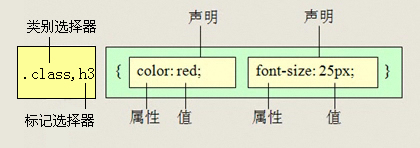
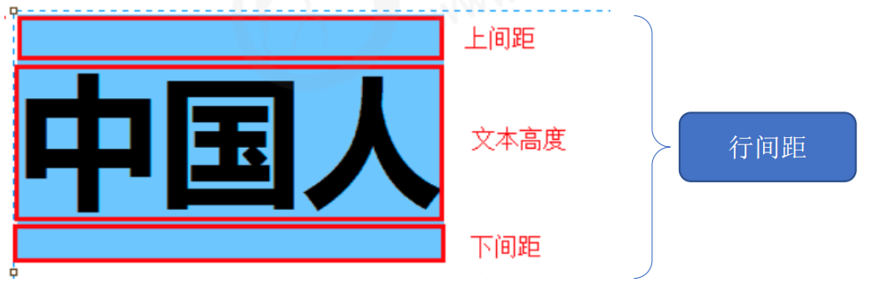
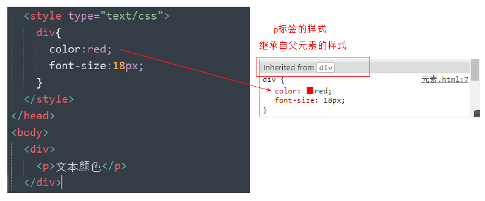
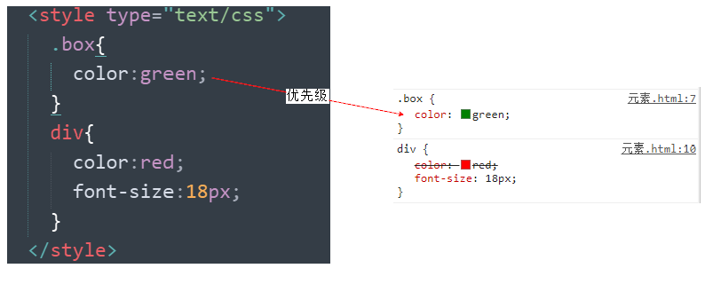

# CSS

层叠样式表

---

## 一、CSS初识

### 1.1 网页的美容师

- 让我们的网页更加丰富多彩，布局更加灵活自如
- CSS的最大贡献就是：让HTML从样式中脱离，实现了HTML专注去做结构呈现，样式交给css

### 1.2 初识

CSS(Cascading Style Sheets)，通常称为CSS样式表或层叠样式表（级联样式表）

- 主要用于设置HTML页面中的文本内容（字体、大小、对齐方式等）、图片的外形（宽高、边框样式、边距等）以及版面的布局和外观显示样式。
- CSS以HTML为基础，提供了丰富的功能，如字体、颜色、背景的控制及整体排版等，而且还可以针对不同的浏览器设置不同的样式。

### 1.3 引入CSS样式表

#### 1.3.1 行内式（内联样式）

```html
<标签名 style="属性1:属性值1; 属性2:属性值2; 属性3:属性值3;"> 内容 </标签名>
```

通过标签的style 属性来设置元素的样式，任何HTML标签都拥有style 属性，用来设置行内样式

```html
<div style="color: red; font-size: 12px;">青春不常在，抓紧谈恋爱</div>
```

- style 其实就是标签的属性
- 样式属性和值中间是`:`
- 多组属性间是`;`
- 只能控制当前的标签和以及嵌套在其中的字标签，造成代码冗余
- ***没有实现样式和结构相分离***

#### 1.3.2 内部样式表（内嵌样式表）

```html
<head>
<style>
	 div {
	 	color: red;
	 	font-size: 12px;
	 }
</style>
</head>
```

- style 标签一般位于head 标签中，理论上可以放在HTML文档的任何地方
- type = "text/css"在html 5 中可以省略
- 只能控制当前的页面
- ***没有彻底分离***

#### 1.3.3 外部样式表（外链式）

```html
<head>
  <link rel="stylesheet" type="text/css" href="css文件路径">
</head>
```

将所有的样式放在一个或多个以.css 为扩展名的外部样式表文件中，通过link 标签将外部样式表文件链接到HTML中

> link 是单标签
>
> link 标签需要放在head 头部标签中，并且指定link 标签的三个属性

| 属性 | 作用                                                         |
| ---- | :----------------------------------------------------------- |
| rel  | 定义当前文档与被链接文档之间的关系，在这里需要指定为“stylesheet”，表示被链接的文档是一个样式表文件。 |
| type | 定义所链接文档的类型，在这里需要指定为“text/CSS”，表示链接的外部文件为CSS样式表。我们都可以省略 |
| href | 定义所链接外部样式表文件的URL，可以是相对路径，也可以是绝对路径。 |

## 二、CSS选择器

>css 选择器的作用：找到特定的HTML页面元素，通俗的说就是选择标签用的，把我们想要的标签选择出来
>
>选对人，做对事

### 2.1 基础选择器

#### 2.1.1 标签选择器

标签选择器（元素选择器）是指用HTML标签名称作为选择器，按标签名称分类 ，为页面中某一类标签指定统一的CSS样式。

```html
标签名{属性1:属性值1; 属性2:属性值2; 属性3:属性值3; } 
```

>优点
>
>- 能够快速为页面中同类型的标签统一样式
>
>缺点
>
>- 不能设计差异化样式

#### 2.2.2 类选择器

```html
.类名  {   
    属性1:属性值1; 
    属性2:属性值2; 
    属性3:属性值3;     
}
<p class='类名'></p>
```

>- 类选择器使用`.`（英文点号）进行标识，后面紧跟类名 
>
>- 长名称或词组可以使用中横线来为选择器命名
>- 不要纯数字、中文等命名，尽量使用英文字母来表示
>- 我们可以给标签指定多个类名，各个类名中间用空格隔开

命名规范：[见文件](Web前端开发规范手册.doc)

#### 2.1.3 id 选择器

id选择器使用`#`进行标识，后面紧跟id名

```html
#id名 {属性1:属性值1; 属性2:属性值2; 属性3:属性值3; }
<p id="id名"></p>
```

元素的id 值是唯一的，只能对应于文档中某一个具体的元素

#### 2.1.4 通配符选择器

通配符选择器用`*`号表示，`*`表示选择所有的标签，它是所有选择器中作用范围最广的，能匹配页面中所有的元素

```css
* {
  margin: 0;                    /* 定义外边距*/
  padding: 0;                   /* 定义内边距*/
}
```

> **注意：**会匹配页面所有的元素，降低页面的响应速度，不建议随便使用

### 2.2 复合选择器

#### 2.2.1 后代选择器

后代选择器又称为包含选择器，用来选择元素或元素组的子孙后代

```
父级 子级{属性:属性值;属性:属性值;}
.class h3{color:red;font-size:16px;}
```


- 当标签发生嵌套时，内层标签就成为外层标签的后代
- 它能选择任何包含在内的标签

#### 2.2.2 子元素选择器

子元素选择器只能选择作为某元素子元素（亲儿子）的元素

```
.class>h3{color:red;font-size:14px;}
```


其写法就是把父级标签写在前面，子级标签写在后面，中间跟一个`>`进行连接

#### 2.2.3 交集选择器

交集选择器由两个选择器构成，找到的标签必须满足：既有标签一的特点，也有标签二的特点


其中第一个为标签选择器，第二个为class 选择器，两个选择器之间**不能有空格**，如h3.special

#### 2.2.4 并集选择器

如果某些选择器定义的相同样式，就可以利用并集选择器，可以让代码更简洁，并集选择器是通过各个选择器通过`,`连接而成的，通常用于集体声明



> 任何形式的选择（包括标签选择器、class类选择器、id选择器等），都可以作为并集选择器的一部分。

#### 2.2.5 链接伪类选择器

伪类选择器是为了和我们刚才学的类选择器区别，伪类选择器用`:`开头

作用：用于向某些选择器添加特殊的效果。比如给链接添加特殊效果，比如可以选择第1个，第n个元素

##### 链接伪类选择器

- a:link /* 未访问的链接 */
- a:visited /* 已访问的链接 */
- a:hover /* 鼠标移动到链接上 */
- a:active /*选定的链接 */

> **注意**
>
> - 写的时候，他们的顺序尽量不要颠倒，按照lvha。顺序，否则可能引起错误
> - 记忆法
>   - **l**o**v**e **ha**te 爱上了讨厌
>   - **lv** 包包  非常 **ha**o
> - 因为叫链接伪类，所以都是利用交集选择器 a:link a:hover
> - 因为a链接浏览器具有默认样式，所以我们实际工作中都需要给链接单独指定样式。
> - 一般很少写全四个状态

## 三、CSS属性

### 3.1 font 字体

#### font-size：大小

font-size 属性用于设置字号

```css
p {  
    font-size:20px; 
}
```

**单位**

- 可以使用相对长度单位，也可以使用绝对长度单位
- 相对长度单位比较常用，推荐使用像素单位px，绝对长度单位使用较少


> - 谷歌浏览器默认的文件大小为16px
>
> - 不同浏览器可能默认显示的字号大小不一致，我们应尽量给一个明确值大小，不要默认大小。一般给body 指定整个页面文字的大小。

#### font-family:字体

font-family 属性用于设置哪一种字体

```css
p{ font-family:"微软雅黑";}
```

- 网页中常用的字体有宋体、微软雅黑、黑体等
- 可以同时指定多个字体，中间以逗号隔开，表示如果浏览器不支持第一个字体，则会尝试下一个，直到找到合适的字体，如果都没有，则以我们电脑默认的字体为准。

```css
p{font-family: Arial,"Microsoft Yahei", "微软雅黑";}
```

> - 各种字体之间必须使用英文状态下的逗号隔开
> - 中文字体需要加英文状态下的引号，英文字体一般不需要加引号。当需要设置英文字体时，英文字体名称必须位于中文字体名之前
> - 如果字体中包含空格、#、$等符号，则该字体必须加英文状态下的单引号或双引号
> - 尽量使用系统默认字体，保证在任何用户的浏览器中都能正确显示。

#### font-weight:字体精细

| 属性值  | 描述                                                         |
| ------- | :----------------------------------------------------------- |
| normal  | 默认值（不加粗的）                                           |
| bold    | 定义粗体（加粗的）                                           |
| 100~900 | **400** 等同于 normal，而 **700** 等同于 bold  我们重点记住这句话 |

>建议使用数据来表示加粗和不加粗

#### font-style:字体风格

| 属性   | 作用                                                    |
| ------ | :------------------------------------------------------ |
| normal | 默认值，浏览器会显示标准的字体样式  font-style: normal; |
| italic | 浏览器会显示斜体的字体样式。                            |

#### font：综合设置字体样式

font 属性用于对字体样式进行综合设置

```css
选择器 { font: font-style  font-weight  font-size/line-height  font-family;}
```

> - 使用font 属性时，必须按上面语法格式中的顺序书写，不能更换顺序，各个属性以空格隔开
> - 其中不需要设置的属性可以省略（取默认值），但必须保留font-size 和 font-family 属性，否则font 属性将不起作用。

### 3.2 color 外观属性

#### color: 文本颜色

color 属性用于定义文本的颜色，取值方式有如下3种 

| 表示           | 属性值                        |
| :------------- | :---------------------------- |
| 预定义的颜色值 | red，green，blue等            |
| 十六进制       | #FF0000，#FF6600，#29D794     |
| RGB代码        | rgb(255,0,0)或rgb(100%,0%,0%) |

> 平常工作中，用16进制的写法是最多的，16进制可以简写，如#ff0000 -> #f00

#### text-align：文本水平对齐方式

text-align 属性用于设置文本内容的水平对齐

| 属性   |       解释       |
| ------ | :--------------: |
| left   | 左对齐（默认值） |
| right  |      右对齐      |
| center |     居中对齐     |

>**注意：**是让盒子里面的内容水平居中，而不是让盒子居中对齐

#### line-height:行间距

- line-height 用于设置行间距，就是行与行之前的距离，即字符的垂直间距，一般称为行高

- line-height 常用的属性值单位有三种

  - 像素px
  - 相对值em
  - 百分比%

  一般使用最多的是px

> 一般情况下，行距比字号大7、8像素左右就可以了

#### text-indent:首行缩进

- text-indent 属性用于设置首行文本的缩进

- 常用的属性值
  - em 字符宽度的倍数
  - 相对于浏览器窗口宽度的百分比%，允许使用负值
  - 建议使用em作为设置单位

#### text-decoration: 文本的装饰

通常我们用于给链接修改装饰效果

| 值           | 描述                                                  |
| ------------ | ----------------------------------------------------- |
| none         | 默认。定义标准的文本。 取消下划线（最常用）           |
| underline    | 定义文本下的一条线。下划线 也是我们链接自带的（常用） |
| overline     | 定义文本上的一条线。（不用）                          |
| line-through | 定义穿过文本下的一条线。（不常用）                    |

### 3.3 line-height 行高

#### 3.3.1  行高测量

行高的测量方法：


基线和基线的距离为行高

#### 3.3.2 单行文本垂直居中

行高我们利用最多的一个地方是：可以让单行文本在盒子中垂直居中对齐

> 文字的行高等于盒子的高度

行高 = 上距离 + 内容高度 + 下距离



上距离和下距离总是相等的，因此文字看上去是垂直居中的。

**行高和高度的三种关系**

- 如果行高等高度 文字会垂直居中
- 如果行高大于高度 文字会偏下
- 如果行高小于高度 文字会偏上

### 3.3 background 背景

#### background-color： 背景颜色

```css
background-color:颜色值;   默认的值是 transparent  透明的
```

#### background-image: 背景图片

```css
background-image : none | url (url) 
// 示例
background-image : url(images/demo.png);
```

| 参数 |              作用              |
| ---- | :----------------------------: |
| none |       无背景图（默认的）       |
| url  | 使用绝对或相对地址指定背景图像 |

小技巧：提倡背景图片后面的地址，**url 不要加引号**

#### background-repat: 背景平铺

```css
background-repeat : repeat | no-repeat | repeat-x | repeat-y 
```

| 参数      |                 作用                 |
| --------- | :----------------------------------: |
| repeat    | 背景图像在纵向和横向上平铺（默认的） |
| no-repeat |            背景图像不平铺            |
| repeat-x  |         背景图像在横向上平铺         |
| repeat-y  |          背景图像在纵向平铺          |

#### background-position: 背景位置

```css
background-position : length || length

background-position : position || position 
```

| 参数     |                              值                              |
| -------- | :----------------------------------------------------------: |
| length   |         百分数 \| 由浮点数字和单位标识符组成的长度值         |
| position | top \| center \| bottom \| left \| center \| right   方位名词 |

注意：

- 必须先指定background-image 属性
- position 后面是x坐标和y坐标。可以使用方位名词或者精确单位
- 如果指定两个值，两个值都是方位名字，则两个值前后顺序无关，比如left top 和 top left 效果一样
- 如果只指定了一个方位名词，另一个值默认居中对齐
- 如果position 后面是精确坐标，那么第一个肯定是x，第二个肯定是y
- 如果只指定一个数值，那该数值一定是x坐标，另一个默认垂直居中
- 如果指定的两个值是精确单位和方位名字混合使用，则第一个值是x坐标，第二个值是y坐标

**实际工作用的最多的，就是背景图片居中对齐了**

#### background-attachment: 背景附着

背景附着就是解释背景是滚动的还是固定的

```css
background-attachment : scroll | fixed 
```

| 参数   |           作用           |
| ------ | :----------------------: |
| scroll | 背景图像是随对象内容滚动 |
| fixed  |       背景图像固定       |

#### 背景简写

- background: 属性的值的书写顺序官方并没有强制标准的。建议如下
- background: 背景颜色 背景图片地址 背景平铺 背景滚动  背景位置;

```css
background: transparent url(image.jpg) repeat-y  scroll center top ;
```

#### 背景透明

```css
background: rgba(0, 0, 0, 0.3)
```

- 最后一个参数是alpha透明度 取值范围 0~1之间
- 我们习惯把0.3的0省略掉，直接写为.3
- 背景半透明是指盒子背景半透明，盒子里的内容不受影响
- 因为是css3所以低于ie9的版本是不支持的

## 四、标签显示模式

>标签显示模式规定了标签以什么方式进行显示，比如div自己占一行，比如span 一行可以放很多个
>
>网页的标签非常多，在不同地方会用到不同类型的标签，以便更好的完成我们的网页
>
>HTML标签一般分为块标签和行内标签两种类型，它们也称块元素和行内元素。

### 4.1 块级元素(block level)

> 常见的块元素有h1, p, div, ul, ol, li 其中div 标签是最典型的块元素

块级元素的特点 

- 比较霸道，自己独占一行
- 高度，宽度，外边距及内边距都可以控制
- 默认宽度是容器（父级宽度）的100%
- 是一个容器及盒子，里面可以放行内或者块级元素

> 只有文字才能组成段落，因为p 里面不能放块级元素，特别是p不能放div，同理还有这些标签h1, h2, h3, h4, h5, h6, dt，他们都是文字类块级标签，里面不能放其他块级元素

### 4.2 行内元素(inline level)

> 常见的行内元素有a, strong, b, em, i, del, s, ins, u, span 等，其中span 标签最典型的行内元素（内联元素）

行内元素的特点

- 相邻行内元素在一行上，一行可以显示多个
- 高、宽直接设置是无效的
- 默认宽度就是它本身内容的宽度
- **行内元素只能容纳文本或其他行内元素**

注意

- 链接里面不能再放链接
- 特殊情况a里面可以放块级元素，但是给a转换一下成块级模式最安全

### 4.3 行内块元素(inline block)

> 在行内元素中有几个特殊的标签 img, input, td ,可以对它们设置宽高和对齐属性（行内块元素）

行内块元素特点

- 和相邻行内元素（行内块）在一行上，但是之间会有空白缝隙。一行可以显示多个
- 默认宽度就是它本身内容的宽度
- 高度、行高、外边距及内边距都可以控制

### 4.4 三种模式总结区别

| 元素模式   | 元素排列               | 设置样式                 | 默认宽度         | 包含                   |
| ---------- | ---------------------- | ------------------------ | ---------------- | ---------------------- |
| 块级元素   | 一行只能放一个块元素   | 可以设置宽度高度         | 容器的100%       | 容器级可以包含任何标签 |
| 行内元素   | 一行可以放多个行内元素 | 不可以直接设置宽度和高度 | 它本身内容的宽度 | 容纳文本或其他行内元素 |
| 行内块元素 | 一行放多个行内块元素   | 可以设置宽度和高度       | 它本身内容的宽度 |                        |

### 4.5 显示模式转换display

- 块转行内：display:inline
- 行内转块：display:block
- 块、行内元素转换为行内块: display:inline-block

## 五、CSS三大特性

### 5.1 CSS层叠性


> 所谓层叠性是指多种CSS样式的叠加，是浏览器处理冲突的一个能力，如果一个属性通过两个相同选择器设置到同一个元素上，那么这个时候一个属性就会将另一个属性层叠掉

原则：

- 样式冲突，遵循的原则就是**就近原则**。哪个样式离着结构近，就执行哪个样式
- 样式不冲突，不会层叠

> css 层叠性最后的执行口诀：长江后浪推前浪，前浪死在沙滩上

### 5.2 CSS继承性



>子标签会继承父标签的某些样式，如文本颜色和字号。想要设置一个可继承的属性，只需将它应用于父元素即可。

注意：

- 恰当地使用继承可以简化代码，降低CSS样式的复杂性。比如有很多子级孩子都需要某个样式，可以给父级指定一个，这些孩子继承过来就好了。
- 子元素可以继承父元素的样式（text-, font-, line- 这些元素开头的可以继承，以及color 属性）

### 5.3 CSS优先级



>定义CSS样式时，经常出现两个或更多规则应用在同一元素上，此时
>
>- 选择器相同，则执行层叠性
>- 选择器不同，就会出现优先级的问题

#### 权重计算公式

关于CSS权重，我们需要一套计算公式来计算，这个就是Css Specifiicity（特殊性）

| 标签选择器            | 计算权重公式 |
| --------------------- | ------------ |
| 继承或者*             | 0,0,0,0      |
| 每个元素(标签选择器)  | 0,0,0,1      |
| 每个类，伪类          | 0,0,1,0      |
| 每个ID                | 0,1,0,0      |
| 每个行内样式 style="" | 1,0,0,0      |
| 每个!important        | ∞ 无穷大     |

- 值从左到右，左面的最大，一级大于一级，数位之前没有进制，级别之间不可超越

- 关于CSS权重，我们需要一套公式去计算

- div {

  ​	color: pink!important

  }

#### 权重叠加

我们经常用交集选择器，后代选择器等，具有多个基础选择器组合而成，那么此时，就会出现权重叠加

- div ul li           0,0,0,3
- .nav ul li          0,0,1,2
- a:hover            0,0,1,1
- .nav a              0,0,1,1

>数位之间没有进制，比如说： 0,0,0,5 + 0,0,0,5 = 0,0,0,10而不是0,0,1,0，所以不会存在 10个div能赶上一个类选择器的情况

#### 继承的权重是0

修改样式，一定要看该标签有没有被选中

- 如果选中了，那么以上面的公式来计算权重，谁大听谁的
- 如果没有权重，那么权重是0，因为继承的权重为0

## 七、一般的骚操作

### Emmet 语法

Emmet 的前身是Zen coding，它使用缩写，来提高html/css 的编写速度。

1. 生成标签：直接输入标签名按tab键即可，比如div 然后tab键，就可以生成`<div></div>`
2. 如果想要生成多个相同标签，加上`*`就可以了，比如 `div*3`就可以快速生成3个div
3. 如果有父子级关系的标签，可以用`>`比如 `ul>li`就可以了
4. 如果有兄弟关系的标签，用`+`就可以，比如 `div+p`
5. 如果生成带有类名或者id名字的，直接写.demo或者#two  tab 键就可以了
6. 如果生成的div类名是有顺序的，可以使用自增符号`$`

```html
.demo$*3        
<div class="demo1"></div>
<div class="demo2"></div>
<div class="demo3"></div>
```

7. 如果想要在生成的标签内部写内容可以用`{}`表示

## 八、拓展阅读

[emment语法](https://www.w3cplus.com/tools/emmet-cheat-sheet.html)