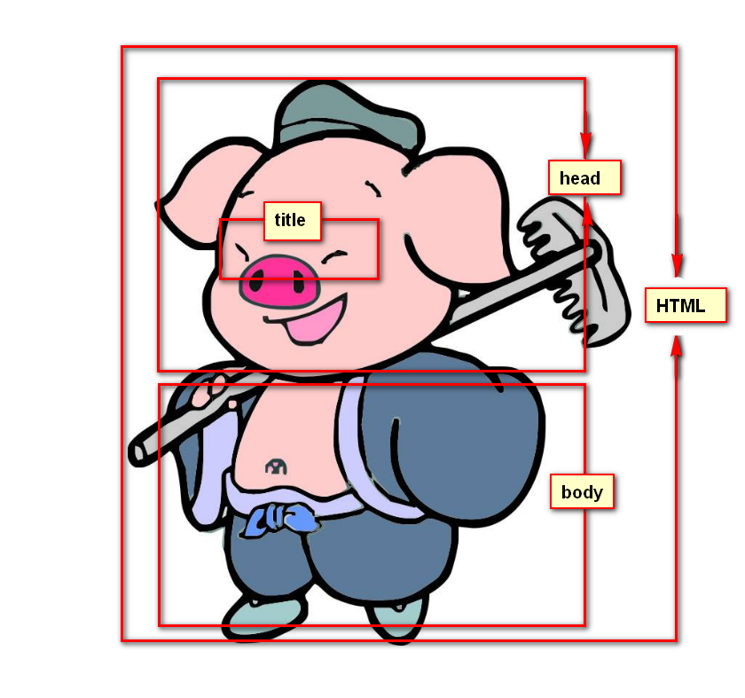
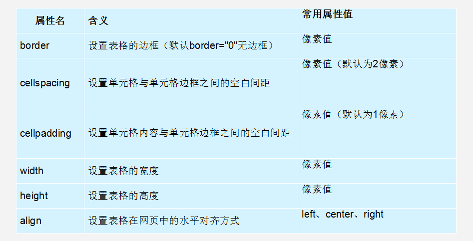

# HTML 5

## 一、浏览器知识

### 1.1 常见浏览器内核

> Rendering Engine （浏览器内核），负责读取网页内容，整理讯息，计算网页的显示方式并显示页面

主要流行的浏览器内核：

| 浏览器  | 内核           | 备注                                                         |
| ------- | -------------- | ------------------------------------------------------------ |
| IE      | Trident        | IE、猎豹安全、360极速浏览器、百度浏览器                      |
| Firefox | Gecko          | 可惜这几年已经没落了，打开速度慢、升级频繁、猪一样的队友flash、神一样的对手chrome。 |
| Safari  | webkit         | 现在很多人错误地把 webkit 叫做 chrome内核（即使 chrome内核已经是 blink 了）。苹果感觉像被别人抢了媳妇，都哭晕再厕所里面了。 |
| chrome  | Chromium/Blink | 在 Chromium 项目中研发 Blink 渲染引擎（即浏览器核心），内置于 Chrome 浏览器之中。Blink 其实是 WebKit 的分支。大部分国产浏览器最新版都采用Blink内核。二次开发 |
| Opera   | blink          | 现在跟随chrome用blink内核。                                  |

>移动端的浏览器内核主要说的是系统内置浏览器的内核。
>
>对于Android手机来说，使用率最高的就是webkit 内核，大部分国产浏览器宣称的自己的内核，基本上也是属于webkit 二次开发
>
>ios及WP7平台上，由于系统原因，系统大部分自带浏览器内核，一般是Safari或者IE内核Trident

### 1.2 Web标准构成

 **构成**：主要包括结构（Structure）、表现（Presentation）和行为（Behavior）三个方面。

| 标准 | 说明                                                    | 备注                               |
| ---- | ------------------------------------------------------- | ---------------------------------- |
| 结构 | 结构用于对网页元素进行整理和分类（HTML）                |    |
| 表现 | 表现用于设置网页元素的版式，颜色，大小等外观样式（CSS） |        |
| 行为 | 行为是指网页模型的定义及交互的编写（JavaScript）        |  |

> - 结构类似人的身体，表现类似人的着装，行为类似人的行为动作
> - 理想状态下，他们三层都是独立的，放到不同的文件里面

## 二、HTML

> - HTML 指的是超文本标记语言（**H**yper **T**ext **M**arkup **L**anguage）就用来描述网页的一种语言
>
> - HTML不是一种编程语言，而是一种标记语言
> - 标记语言是一套标记标签
>
> 网页是由网页元素组成的，这些元素是利用html标签描述出来，然后通过浏览器解析

**所谓超文件，有2层含义**

1. 因为它可以加入图片、声音、动画、多媒体等内容（**超越文本限制**）
2. 不仅如此，它还可以从一个文件跳转到另一个文件，与世界各地的主机的文件连接（**超级链接文本**）

### 2.1 HTML骨架标签

HTML有自己的语言语法骨架格式：（要遵循、要专业）

```html
<html>   
    <head>     
        <title></title>
    </head>
    <body>
    </body>
</html>
```

**html骨架标签总结**

| 标签名           |    定义    | 说明                                                    |
| ---------------- | :--------: | :------------------------------------------------------ |
| <html></html>    |  HTML标签  | 页面中最大的标签，我们成为  根标签                      |
| <head></head>    | 文档的头部 | 注意在head标签中我们必须要设置的标签是title             |
| <titile></title> | 文档的标题 | 让页面拥有一个属于自己的网页标题                        |
| <body></body>    | 文档的主体 | 元素包含文档的所有内容，页面内容 基本都是放到body里面的 |

为了便于记忆，可以记下图



#### 2.1.1 HTML元素标签分类

**标签**

在HTML页面中，带有`<>`符号的元素被称为HTML标签，如上面提到的 `<html>`、`<head>`、`<body>`都是HTML骨架结构标签。

**分类**

1. 常见元素（双标签）

```html
<标签名> 内容 </标签名>   比如 <body>  我是文字  </body>
```

* 该语法中“<标签名>”表示该标签的作用开始，一般称为“开始标签（start tag）”，“</标签名>” 表示该标签的作用结束，一般称为“结束标签（end tag）”。
* 和开始标签相比，结束标签只是在前面加了一个关闭符“/”。
* 我们以后接触的基本都是双标签

2. 空元素（单标签）

```html
<标签名 />  比如  <br />
```

* 空元素 用单标签来表示， 简单点说，就是里面不需要包含内容， 只有一个开始标签不需要关闭。
* 这种单身狗标签非常少，一共没多少，我们多记忆就好

#### 2.1.2 文档类型

**用法：**

```html
<!DOCTYPE html>
```

**作用：**

声明位于文档中的最前面的位置，处于标签之前。此标签用于告知浏览器文档使用哪种HTML或XHTML规范。

#### 2.1.3 页面语言lang

```html
<html lang="en">
```

最常见的两个

1. `end`定义语言为英语
2. `zh-CN`定义语言为中文

> 可能对于程序来说没有太大的作用，但是它可以告诉浏览器，搜索引擎，一些处理Html的程序对页面语言内容来做一些对应的处理或者事情。
>
> 例如：
>
> - 根据lang属性来设定不同语言的css样式，或者字体
> - 告诉搜索引擎做精确的识别
> - 让语法检查程序做语言识别
> - 帮助翻译工具做识别
> - 帮助网页阅读程序做识别
> - ...

#### 2.1.4 字符集

```html
<meta charset="UTF-8" />
```

这句代码非常关键，是必须要写的代码，否则可能引起乱码的情况。

#### 2.1.5 HTML标签的语义化

> 标签语义化，就是指标签的含义
>
> 根据标签的语义，在合适的地方给一个最为合理的标签，让结构更清晰。
>
> 1. 方便代码的阅读和维护
> 2. 同时让浏览器或是网络爬虫可以很好地解析，从而更好分析其中的内容
> 3. 使用语义化标签会具有更好地搜索引擎优化


语义是否良好：当我们去掉CSS之后，网页结构依然组织有序，并且有良好的可读性。（裸奔起来一样好看）

遵循的原则：先确定语义的HTML，再选合适的CSS。

### 2.2 HTML常用标签

#### 2.2.1 排版标签

排版标签主要和css 搭配使用，显示网页结构的标签，是网页布局最常用的标签。

##### 标题标签h

单词缩写：head 头部，标题 title  文档标题

为了使网页更具有语义化，我们经常会在页面中用到标题标签，HTML提供了6个等级的标题

标题标签语义：作为标题使用，并且依据重要性递减

```html
<h1>   标题文本   </h1>
<h2>   标题文本   </h2>
<h3>   标题文本   </h3>
<h4>   标题文本   </h4>
<h5>   标题文本   </h5>
<h6>   标题文本   </h6>
```

- 加了标题的文字会变粗，字号也会变大
- 一行只能放一个标题

##### 段落标签p

单词缩写： paragraph 段落

可以把HTML文档分割为若干段落

```html
<p>  文本内容  </p>
```

HTML文档中最常见的标签，默认情况下，文本在一个段落中会根据浏览器窗口的大小自动换行。

##### div 和 span 标签

div span 是没有语义的，是我们网页布局主要的2个盒子

div 就是 division 的缩写 分割 ，分区的意思，其实有很多div 来组合网页。

span 跨度，跨距；范围

```html
<div> 这是头部 </div>    <span>今日价格</span>
```

> - div 标签用来布局，一行只放一个div
>
> - span 标签用来布局，一行上可以放好多个span

##### 其他排版标签及总结

| 标签名        | 定义       | 说明                                  |
| ------------- | :--------- | :------------------------------------ |
| <hx></hx>     | 标题标签   | 作为标题使用，并且依据重要性递减      |
| <p></p>       | 段落标签   | 可以把 HTML 文档分割为若干段落        |
| <hr />        | 水平线标签 | 没啥可说的，就是一条线                |
| <br />        | 换行标签   |                                       |
| <div></div>   | div标签    | 用来布局的，但是现在一行只能放一个div |
| <span></span> | span标签   | 用来布局的，一行上可以放好多个span    |

#### 2.2.2 文本格式化标签


在网页中，有时需要为文字设置粗体、斜体或下划线效果，这时就需要用到HTML中的文本格式化标签，使文字以特殊的方式显示。

#### 2.2.3 标签属性

属性就是外在特性，比如手机的颜色，尺寸等

使用HTML制作网页时，如果想让HTML标签提供更多的信息，可以使用HTML标签的属性加以设置。其基本语法格式如下：

```html
<标签名 属性1="属性值1" 属性2="属性值2" …> 内容 </标签名>
<手机 颜色="红色" 大小="5寸">  </手机>
```

#### 2.2.4 图像标签img

单词缩写：   image  图像

要想在网页中显示图像就需要使用图像标签，接下来将详细介绍图像标签以及和他相关的属性。**（它是一个单身狗）**

```html

```


> 1. 标签可以拥有多个属性，必须写在开始标签中，位于标签名后面。
> 2. 属性之间不分先后顺序，标签名与属性、属性与属性之间均以空格分开。
> 3. 采用键值对的格式， key = "value"的格式

```html
<br />
     带有边框的<br />
    <br />
	有提示文本的<br />
	<br />
	有替换文本的<br />
	
```

#### 2.2.5 链接标签

单词缩写：  anchor 的缩写 。基本解释 锚, 铁锚 的

```html
<a href="跳转目标" target="目标窗口的弹出方式">文本或图像</a>
```

| 属性   | 作用                                                         |
| ------ | :----------------------------------------------------------- |
| href   | 用于指定链接目标的url地址，（必须属性）当为标签应用href属性时，它就具有了超链接的功能 |
| target | 用于指定链接页面的打开方式，其取值有_self和_blank两种，其中_self为默认值，__blank为在新窗口中打开方式。 |

> 1. 外部链接，需要添加http://
> 2. 内部链接，直接链接内部页面名称即可
> 3. 如果当前没有确定链接目标时，通常将链接标签的`href`属性值定义为`#`  ，表示该链接暂时为一个空链接
> 4. 不仅可以创建文本超链接，在网页中各种网页元素，如图像、表格、音频、视频等都可以添加超链接。

#### 2.2.6 注释标签

注释内容不会显示在浏览器窗口中，但是作为HTML文档内容的一部分，也会被下载到用户的计算机上，查看源代码时就可以看到。

```html
<!-- 注释语句 -->
```

#### 2.2.7 表格table

表格常用于显示、展示表格数据。

```html
<table>
  <tr>
    <td>单元格内的文字</td>
    ...
  </tr>
  ...
</table>
```

1. table用于定义一个表格标签。
2. tr标签 用于定义表格中的行，必须嵌套在 table标签中。
3. td 用于定义表格中的单元格，必须嵌套在<tr></tr>标签中。
4. 字母 td 指表格数据（table data），即数据单元格的内容，现在我们明白，表格最合适的地方就是用来存储数据的。


##### 表格属性



我们经常有个说法，是三参为0，  平时开发的我们这三个参数    border  cellpadding  cellspacing  为  0


##### 表头单元格标签th

- 作用：
  - 一般表头单元格位于表格的第一行或第一列，并且文本加粗居中
- 语法：
  - 只需用表头标签&lt;th&gt;</th&gt;替代相应的单元格标签&lt;td&gt;</td&gt;即可。 

##### 表格标题caption

```html
<table>
   <caption>我是表格标题</caption>
</table>
```

**合并单元格**

**合并单元格两种方式**

1. 跨行合并：rowspan="合并单元格的个数"      
2. 跨列合并：colspan="合并单元格的个数"

**合并单元格顺序**

合并的顺序我们按照    先上后下   先左后右的顺序

##### 表格划分结构

对于比较复杂的表格，表格的结构也就相对的复杂了，所以又将表格分割成三个部分：题头、正文和脚注。而这三部分用 `thead`、`tbody`、`tfoot` 来标注，这样更好的分清表格结构

>- thead 用于定义表格的头部。用来存放标题之类的东西。thead 内部必须拥有`tr`标签
>- tbody 用于定义表格的主体，放数据内容
>- tfoot 放表格的脚注之类
>
>以上这些标签没有顺序，浏览器会自动调整标签的位置以正确输出表格信息

##### 总结

| 标签名              | 定义           | 说明                                         |
| ------------------- | :------------- | :------------------------------------------- |
| <table></table>     | 表格标签       | 就是一个四方的盒子                           |
| <tr></tr>           | 表格行标签     | 行标签要再table标签内部才有意义              |
| <td></td>           | 单元格标签     | 单元格标签是个容器级元素，可以放任何东西     |
| <th></th>           | 表头单元格标签 | 它还是一个单元格，但是里面的文字会居中且加粗 |
| <caption></caption> | 表格标题标签   | 表格的标题，跟着表格一起走，和表格居中对齐   |
| clospan 和 rowspan  | 合并属性       | 用来合并单元格的                             |

#### 2.2.8 列表标签

##### 无序列表

无序列表的各个列表项之间没有顺序级别之分，是并列的

```html
<ul>
  <li>列表项1</li>
  <li>列表项2</li>
  <li>列表项3</li>
  ......
</ul>
```

> 1. `<ul></ul>`中只能嵌套`<li></li>`，直接ul 标签中输入其他标签或文字是不被允许的
> 2. `<li>`与`</li>`之间相当于一个容器，可以容纳所有元素

##### 有序列表

有序列表即为有排列顺序的表，其各个列表项按照一定的顺序排列定义

```html
<ol>
  <li>列表项1</li>
  <li>列表项2</li>
  <li>列表项3</li>
  ......
</ol>
```

> 所有特性基本与`ul`一致，但是实际中比无序列表用的少很多

##### 自定义列表

定义列表常用于对术语或名词进行解释和描述，定义列表的列表项前没有任何项目符号

```html
<dl>
  <dt>名词1</dt>
  <dd>名词1解释1</dd>
  <dd>名词1解释2</dd>
  ...
  <dt>名词2</dt>
  <dd>名词2解释1</dd>
  <dd>名词2解释2</dd>
  ...
</dl>
```


#### 2.2.9 表单标签

**作用:**

表单的目的是为了收集用户信息

> 在HTML中，一个完整的表单通常由表单控件（也称为表单元素）、提示信息和表单域3个部分组成


**表单控件：**

​	包含了具体的表单功能项，如单行文本输入框、密码输入框、复选框、提交按钮、重置按钮等。

**提示信息：**

​	一个表单中通常还需要包含一些说明性的文字，提示用户进行填写和操作

**表单域：**

​	相当于一个容器，用来容纳所有的表单控件和提示信息，可以通过它定义处理表单数据所用程序的url以及数据提交到服务器的方法。如果不定义表单域，表单中的数据就无法传送到后台服务器。

##### input 控件

```html
<input type="属性值" value="你好">
```

- `<input />`标签为单标签
- `type`属性设置不同的属性值用来指定不同的控件类型

常用属性


**type 属性**

* 这个属性通过改变值，可以决定了你属于那种input表单。
* 比如 type = 'text'  就表示 文本框 可以做 用户名， 昵称等。
* 比如 type = 'password'  就是表示密码框   用户输入的内容 是不可见的。

```html
用户名: <input type="text" /> 
密  码：<input type="password" />
```

 **value属性   值**

```html
用户名:<input type="text"  name="username" value="请输入用户名"> 
```

* value 默认的文本值。 有些表单想刚打开页面就默认显示几个文字，就可以通过这个value 来设置。

 **name属性**

~~~html
用户名:<input type="text"  name=“username” />  
~~~

name表单的名字， 这样，后台可以通过这个name属性找到这个表单。  页面中的表单很多，name主要作用就是用于区别不同的表单。

* name属性后面的值，是我们自己定义的。


* radio  如果是一组，我们必须给他们命名相同的名字 name   这样就可以多个选其中的一个啦

```html
<input type="radio" name="sex"  />男
<input type="radio" name="sex" />女
```

* name属性，我们现在用的较少， 但是，当我们学ajax 和后台的时候，是必须的。

 **checked属性**

* 表示默认选中状态。  较常见于 单选按钮和复选按钮。

```html
性    别:
<input type="radio" name="sex" value="男" checked="checked" />男
<input type="radio" name="sex" value="女" />女 
```

上面这个，表示就默认选中了 男 这个单选按钮

 **input 属性小结**

| 属性    | 说明     | 作用                                                   |
| ------- | :------- | ------------------------------------------------------ |
| type    | 表单类型 | 用来指定不同的控件类型                                 |
| value   | 表单值   | 表单里面默认显示的文本                                 |
| name    | 表单名字 | 页面中的表单很多，name主要作用就是用于区别不同的表单。 |
| checked | 默认选中 | 表示那个单选或者复选按钮一开始就被选中了               |

##### label 标签

label 标签主要目的是为了提高用户体验。为用户提供最优秀的服务。为input 元素定义标注。作用是用于绑定一个表单元素，当点击label 标签的时候，被绑定的表单元素就会获得输入焦点。

两种绑定方式

1. 第一种用法就是用 label直接包裹input 表单

```html
<label> 用户名： <input type="radio" name="usename" value="请输入用户名">   </label>
```

2. 第二种用法`for`属性规定label 与哪个表单元素绑定

```html
<label for="sex">男</label>
<input type="radio" name="sex"  id="sex">
```

##### textarea 控件

```html
<textarea >
  文本内容
</textarea>
```

**作用：**

通过textarea控件可以轻松地创建多行文本输入框.

cols="每行中的字符数" rows="显示的行数"  我们实际开发不用

**文本框和文本域区别**

| 表单              |  名称  |       区别       |                  默认值显示 |             用于场景 |
| :---------------- | :----: | :--------------: | --------------------------: | -------------------: |
| input type="text" | 文本框 | 只能显示一行文本 | 单标签，通过value显示默认值 | 用户名、昵称、密码等 |
| textarea          | 文本域 | 可以显示多行文本 |  双标签，默认值写到标签中间 |               留言板 |

##### select 下拉列表

```html
<select>
  <option>选项1</option>
  <option>选项2</option>
  <option>选项3</option>
  ...
</select>
```

> 1. &lt;select&gt;  中至少包含一对 option 
> 2. 在option 中定义selected =" selected "时，当前项即为默认选中项。

##### form 表单域

在HTML中，form 标签被用于定义表单域，以实现用户信息的收集和传递，form 中的所有内容都会被提交到服务器

```html
<form action="url地址" method="提交方式" name="表单名称">
  各种表单控件
</form>
```

**常用属性：**

| 属性   | 属性值   | 作用                                               |
| ------ | :------- | -------------------------------------------------- |
| action | url地址  | 用于指定接收并处理表单数据的服务器程序的url地址。  |
| method | get/post | 用于设置表单数据的提交方式，其取值为get或post。    |
| name   | 名称     | 用于指定表单的名称，以区分同一个页面中的多个表单。 |

#### 2.2.10 其他标签

##### 锚点定位

通过创建锚点链接，用户能够快速定位到目标内容。

创建锚点链接分为两步：

```html
1. 使用相应的id名标注跳转目标的位置。 (找目标)
  <h3 id="two">第2集</h3> 

2. 使用<a href="#id名">链接文本</a>创建链接文本（被点击的） （拉关系）  我也有一个姓毕的姥爷..
  <a href="#two">   
```

##### base 标签

```
<base target="_blank" />
```

> - base 可以设置整体链接的打开状态
> - base 写到`<head></head>`之间
> - 把所有的链接都默认添加target="_blank"（上述示例）

##### 预格式化文本pre标签

标签可定义预格式化的文本

被包围在`<pre>`标签元素中的文本通常会保留空格和换行符，。而文本也会呈现为等宽字体

```html
<pre>

  此例演示如何使用 pre 标签

  对空行和 空格

  进行控制

</pre>
```

> 所谓的预格式化文本就是 ，按照我们预先写好的文字格式来显示页面， 保留空格和换行等。 

##### 特殊字符


>1. 以运算符`&`开头，以分号运算符`;`结尾
>2. 不是标签，而是符号
>3. HTML中不能使用小于号和大于号特殊字符，浏览器会将它们作为标签解析，若要正确显示，在HTML源代码中使用字符实体

## 三、相关文档

W3C :  http://www.w3school.com.cn/

MDN: https://developer.mozilla.org/zh-CN/