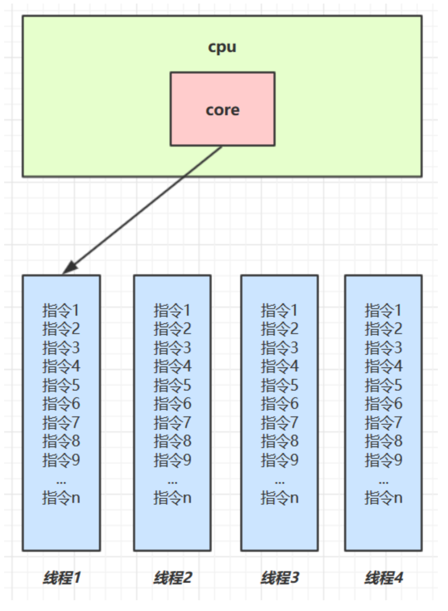
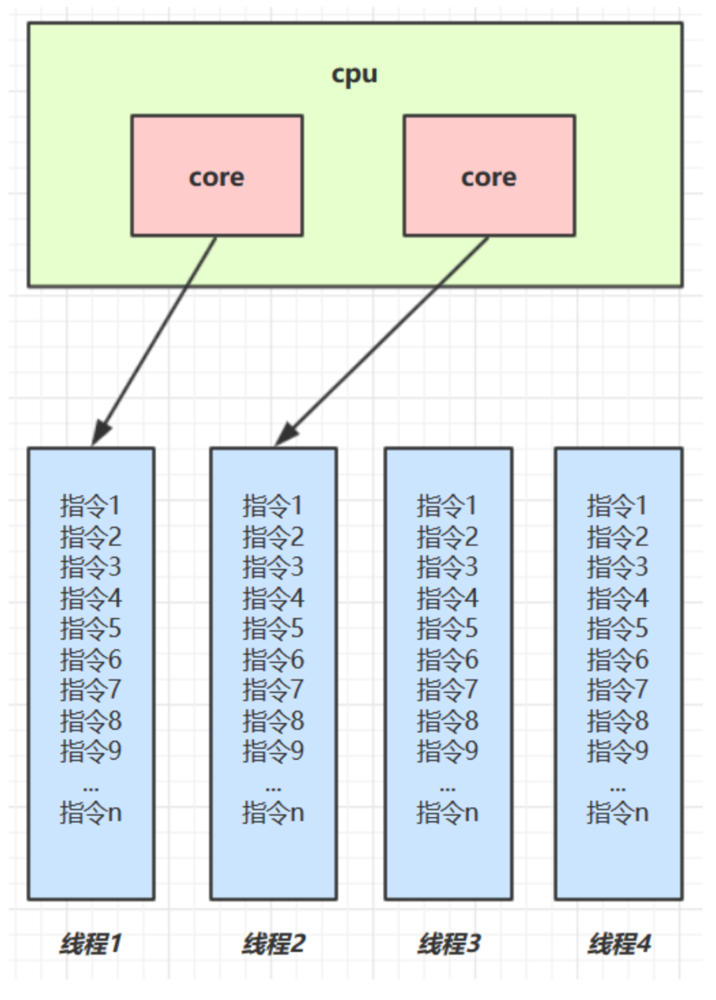
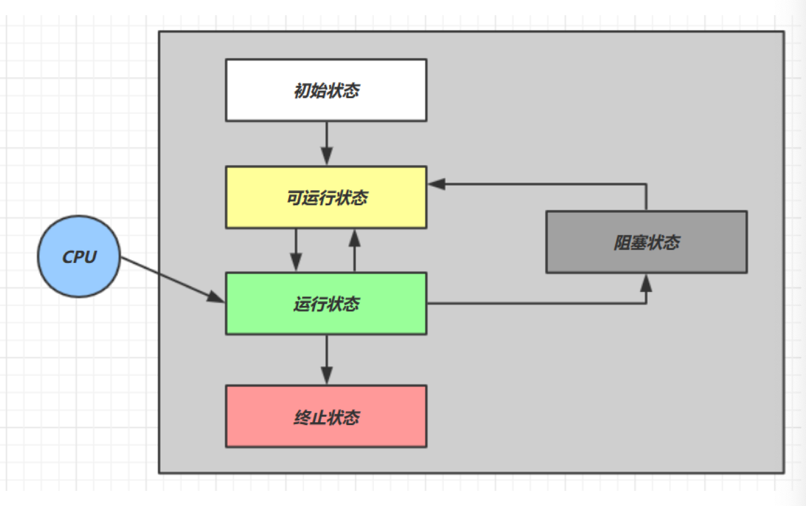
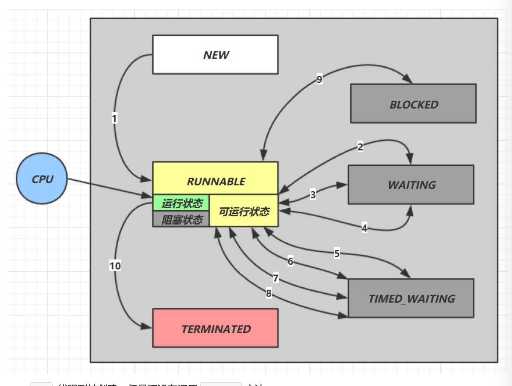

# Java并发

## 一、基本概念

### 1.1 进程与线程

**进程**

- 程序由指令和数据组成，但这些指令要运行，数据要读写，就必须将指令加载至CPU，数据加载至内存。在指令运行过程中还需要用到磁盘、网络等设备。进程就是用来加载指令、管理内存、管理IO的
- 当一个程序被运行，从磁盘加载这个程序的代码至内存，这时就开启了一个进程
- 进程就可以视为程序的一个实例。大部分程序可以同时运行多个实例进程（例如记事本、画图、浏览器等），也有的程序只能启动一个实例进程（例如网易云音乐、360安全卫士等）

**线程**

- 一个进程之内可以分为一到多个线程
- 一个线程就是一个指令流，将指令流中的一条条指令以一定的顺序交给CPU执行
- Java中，线程作为**最小调度单位**，进程作为**资源分配的最小单位**。在windows 中进程是不活动的，只是作为线程的容器

**二者对比**

- 进程基本上相互独立，而线程存在于进程内，是进程的一个子集
- 进程拥有共享的资源，如内存空间等，供其内部的线程共享
- 进程间通信较为复杂
  - 同一台计算机的进程通信称为IPC(Inter-process communication)
  - 不同计算机之间的进程通信，需要通过网络，并遵守共同的协议，例如HTTP
- 线程通信相对简单，因为它们共享进程内的内存，多个线程可以访问同一个共享变量
- 线程更轻量，线程上下文切换成本一般要比进程上下文切换低

### 1.2 并行与并发

单核CPU下，线程实际还是`串行执行`的。操作系统中有一个组件叫做任务调度器，将CPU的时间片（windws 下时间片最小约为15毫秒）分给不同的程序使用，只是由于CPU在线程间（时间片很短）的切换非常快，人类感觉是`同时运行的`。总结为一句话就是：`微观串行，宏观并行`，一般会将这种`线程轮流使用CPU`的做法叫做`并发(concurrent)`



多核CPU下，每个`核（core）`都可以调度运行线程，这时候线程可以是并行的。



引用Rob Pike 的一段描述：

- 并发（concurrent）是同一时间应对（dealing with）多件事情的能力
- 并发（parallel）是同一时间动手做（doing）多件事情的能力

例子

- 家庭主妇做饭、打扫卫生、给孩子喂奶，她一个人轮流交替做这多件事，这时就是并发
- 家庭主妇雇了个保姆，她们一起做这些事，这时既有并发，也有并行（这时会产生竞争，例如锅只有一口，一个人用锅时，另一个人就得等待）

- 雇了3个保姆，一个专做饭、一个专打扫卫生、一个专喂奶，互不干扰，这时是并行

### 1.3 异步

以调度方角度来讲，如果

- 需要等待结果返回，才能继续运行就是同步
- 不需要等待结果返回，就能继续运行就是异步

多线程可以让方法执行变为异步的，比如读取磁盘文件时，假设读取花费5秒钏，如果没有线程调度机制，这5秒CPU什么都做不了，其它代码都得暂停

**应用举例**

- 比如在项目中，视频文件需要转换格式等操作比较费时，这时开一个新线程处理视频转换，避免阻塞主线程
- tomcat 的异步servlet 也是类似的目的，让用户线程处理耗时较长的操作，避免阻塞tomcat 的工作线程
- ui程序中，开线程进行其他操作，避免阻塞ui线程

### 1.4 提高效率

充分利用多核CPU的优势，提高运行效率

- 单核CPU下，多线程不能实际提高程序的运行效率，只是为了能够在不同的任务之间切换，不同线程轮流使用CPU，不至于一个线程总占用CPU，别的线程没法干活
- 多核CPU可以并行跑多个线程，但能否提高程序运行效率还是要分情况的
  - 有些任务，经过精心设计，将任务拆分，并行执行，当然可以提高程序的运行效率。但不是所有计算任务都能拆分
  - 也不是所有任务都需要拆分，任务的目的如果不同，谈拆分和效率没啥意义
- IO操作不占用CPU，只是我们一般拷贝文件使用的是【阻塞IO】，这时相当于线程虽然不用CPU，但需要等待IO结束，没能充分利用线程，所以才有后面的【非阻塞IO】和【异步IO】优化

##  二、Java线程

### 2.1 创建和运行线程

#### 2.1.1  使用Thread创建线程

```java
// 创建线程对象
Thread t = new Thread() {
  @Override
  public void run() {
    // 要执行的任务
  }
};
// 启动线程
t.start();
```

#### 2.1.2 使用Runnable 配合 Thread

把【线程】和【任务】（要执行的代码）分开

- Thread 代表线程
- Runnable 可运行的任务（线程要执行的代码）

```java
Runnable runnable = new Runnable() {
  @Override
  public void run() {
    // 要执行的任务
  }
};
// 创建线程对象
Thread t = new Thread(runnable);
// 启动线程
t.start();
```

#### 2.1.3 使用FutureTask 配合Thread

FutureTask能够接收Callable 类型的参数，用来处理有返回结果的情况

```java
// 创建任务对象
FutureTask<Integer> task3 = new FutureTask<>(() -> {
  log.debug("hello");
  return 100;
});
new Thread(task3, "t3").start();

// 主线程阻塞，同步等待task执行完毕的结果
Integer result = task3.get();
log.debug("结果是:{}", result);
```

#### 2.1.3 小结

- 方式1是把线程和任务合并在了一起，方法2是把线程和任务分开了
- 用Runnable 更容易与线程池等高级API配合
- 用Runnable 让任务类脱离了Thread继承体系，更灵活

- Runnable 和 callable 区别在于是否返回结果信息

### 2.2 查看进程线程的方法

**Windows**

- 任务管理器可以查看进程和线程数，也可以用来杀死进程
- `tasklist`查看进程
- `taskkill`杀死进程

**Linux**

- `ps -fe` 查看所有进程
- `ps -fT -p <PID>`查看某个进程（PID）的所有线程
- `kill`杀死进程
- `top` 按大写H切换是否显示线程
- `top -H -p <PID>`查看某个进程（PID）的所有线程

**Java**

- `jps`命令查看所有java进程
- `jstack <PID>`查看某个Java进程（PID）的所有线程状态
- `jconsole`来查看某个Java进程中线程的运行情况（图形界面）

jconsole 远程监控配置

- 需要以如下方式运行你的Java类

```shell
 java -Djava.rmi.server.hostname=`ip地址` -Dcom.sun.management.jmxremote - Dcom.sun.management.jmxremote.port=`连接端口` -Dcom.sun.management.jmxremote.ssl=是否安全连接 - Dcom.sun.management.jmxremote.authenticate=是否认证 java类
```

- 修改/etc/hosts文件将127.0.0.1 映射至主机名

如果要认证访问，还需要做如下步骤

- 复制jbxremote.password文件
- 修改jmxremote.password和jmxremote.access文件的权限为600即文件所有者可读写
- 连接时填入controlRole(用户名),R&D(密码)

### 2.3 线程运行原理

#### 2.3.1 栈与栈桢

Java Virtual Machine Stacks (Java虚拟机栈)

JVM中由堆、栈、方法区所组成，其中栈内存是给谁用的？其实就是线程，每个线程启动后，虚拟机就会为其分配一块栈内存

- 每个栈由多个栈桢(Frame)组成，对应着每次方法调用时所占用的内存
- 每个线程只能有一个活动栈桢，对应着当前正在执行的那个方法

#### 2.3.2 线程上下文切换（Thread Context Switch）

因为以下一些原因导致CPU不再执行当前的线程，转而执行另一个线程的代码

- 线程的CPU时间片用完
- 垃圾回收
- 有更高优先级的线程需要运行
- 线程自己调用了sleep、yield、wait、join、park、synchronized、lock等方法

当Context Switch 发生时，需要由操作系统保存当前线程的状态，并恢复另一个线程的状态，Java中对应的概念就是程序计数器(Program Counter Register)，它的作用是记住下一条jvm指令的执行地址，是线程私有的

- 状态包括程序计数器，虚拟机栈中每个栈桢的信息，如局部变量、操作数栈、返回地址等
- Context Switch 频繁发生会影响性能

### 2.4 常见方法

| 方法名           | static | 功能说明                                                   | 注意                                                         |
| ---------------- | ------ | ---------------------------------------------------------- | ------------------------------------------------------------ |
| start()          |        | 启动一个新线程，在新的线程运行run方法中的代码              | start方法只是让线程进入就绪，里面代码不一定立刻运行（CPU的时间片还没分给它）。每个线程对象的start方法只能调用一次，如果调用了多次会出现IllegalThreadStateExcpeiton |
| run()            |        | 新线程启动后调用的方法                                     | 如果在构造 Thread对象时传递了Runnable 参数，则线程启动后会调用Runnable 中的run方法，否则默认不执行任何操作。但是可以创建Thread的子类对象，来覆盖默认行为 |
| join()           |        | 等待线程运行结束                                           |                                                              |
| join(long n)     |        | 等待线程运行结束，最多等待n毫秒                            |                                                              |
| getId()          |        | 获取线程长整型的id                                         | id 唯一                                                      |
| getName()        |        | 获取线程名                                                 |                                                              |
| setName(String)  |        | 修改线程名                                                 |                                                              |
| getPriority()    |        | 获取线程优先级                                             |                                                              |
| setPriority(int) |        | 修改线程优先级                                             | java中规定线程优先级是1-10的整数，较大的优先级能提高该线程被CPU调度的机率 |
| getState()       |        | 获取线程状态                                               | java中线程状态是用6个enum表示，分别为：NEW、RUNNABLE、BLOCKED、WAITING、TIMED_WAITING、TERMINATED |
| isInterrupted()  |        | 判断是否被打断                                             | 不会清除`打断标记`                                           |
| isAlive()        |        | 线程是否存活（还没有运行完毕）                             |                                                              |
| interrupt()      |        | 打断线程                                                   | 如果被打断线程正在sleep、wait、join会导致被打断的线程抛出InterrutpedException，并清除`打断标记`；如果打断的正在运行的线程，则会设置`打断标记`;park的线程被打断，也会设置`打断标记` |
| interrupted()    | static | 判断当前线程是否被打断                                     | 会清除`打断标记`                                             |
| currentThread()  | static | 获取当前正在执行的线程                                     |                                                              |
| sleep(long)      | static | 让当前执行的线程休眠n毫秒，休眠时让出cpu的时间片给其它线程 |                                                              |
| yield()          | static | 提示线程调度器让出当前线程对CPU的使用                      | 主要为了测试和调试                                           |

#### 2.4.1 run 和 start

- 直接调用run 是在主线程中执行了run，没有启动新的线程
- 使用start是启动新的线程，通过新的线程间接执行run中的代码

#### 2.4.2 sleep 和 yield

**sleep**

- 调用sleep 会让当前线程从Running 进入 Time Waiting 状态（阻塞）
- 其它线程可以使用interrupt 方法打断正在睡眠的线程，这时sleep方法会抛出InterruptedException
- 睡眠结束后的线程未必会立刻得到执行
- 建议用TimeUnit 的sleep代替Thread 的sleep来获得更好的可读性

**yield**

- 调用yield 会让当前线程从Running 进入Runnable 就绪状态，然后调度执行其它线程
- 具体的实现依赖于操作系统的任务调度器

#### 2.4.3 线程优先级

- 线程优先级会提示(hint)调度器优先调度该线程，但它仅仅是一个提示，调度器可以忽略它
- 如果CPU比较忙，那么优先级高的线程会获得更多的时间片，但是CPU闲时，优先级几乎没作用

#### 2.4.4 join 方法

在很多情况下，主线程创建并启动子线程，如果子线程中要进行大量的耗时运算，主线程将可能早于子线程结束。如果主线程需要知道子线程的执行结果时，就需要等待子线程执行结束。主线程可以sleep(n)，但这样的n时间不好确定，因为子线程的执行时间不确定，join()方法比较合适这个场景。

#### 2.4.5 interrupt 方法详解

Java 中的线程中断是一种线程间的协作模式，通过设置线程的中断标志并不能直接终止该线程的执行，而是被中断的线程根据中断状态自行处理。

##### 2.4.5.1 打断sleep wait join 的线程

**sleep, wait, join**的方法会让线程进入阻塞状态，**打断这种阻塞的线程会清空打断状态**

以sleep 为例

```java
private static void test1() throws InterruptedException {
	Thread t1 = new Thread(() -> {
    sleep(1)
  }, "t1");
  t1.start();
  
  sleep(0.5);
  t1.interrupt();
  log.debug("打断状态：{}", t1.isInterrupted());
}
```

输出

```java
java.lang.InterruptedException: sleep interrupted 
  at java.lang.Thread.sleep(Native Method) 
  at java.lang.Thread.sleep(Thread.java:340) 
  at java.util.concurrent.TimeUnit.sleep(TimeUnit.java:386) 
  at cn.itcast.n2.util.Sleeper.sleep(Sleeper.java:8) 
  at cn.itcast.n4.TestInterrupt.lambda$test1$3(TestInterrupt.java:59) 
  at java.lang.Thread.run(Thread.java:745) 
21:18:10.374 [main] c.TestInterrupt - 打断状态: false
```

##### 2.4.5.2 打断正常运行的线程

打断正常运行的线程，**不会清空打断状态**

```java
public static void test2() throws InterruptedException {
        Thread t2 = new Thread(() -> {
            while (true) {
                Thread currentThread = Thread.currentThread();
                boolean isInterrupted = currentThread.isInterrupted();
                if (isInterrupted) {
                    log.debug("打断状态: -> {}", isInterrupted);
                    break;
                }
            }
        }, "t2");
        t2.start();
        TimeUnit.SECONDS.sleep(1);
        t2.interrupt();

    }
```

```java
// 输出
22:31:42.205 c.TestInterrupt2 [t2] - 打断状态: -> true
```

##### 2.4.5.3 打断park 线程

打断park 线程，不会清空打断状态

```java
public static void test3() throws InterruptedException {
        Thread t3 = new Thread(() -> {
            log.debug("park");
            LockSupport.park();
            log.debug("interrupted");
            log.debug("打断状态: -> {}", Thread.currentThread().isInterrupted());
        });

        t3.start();
        TimeUnit.SECONDS.sleep(1);
        t3.interrupt();
    }
```

```java
// 输出
22:36:12.136 c.TestInterrupt2 [Thread-0] - park
22:36:13.136 c.TestInterrupt2 [Thread-0] - interrupted
22:36:13.136 c.TestInterrupt2 [Thread-0] - 打断状态: -> true
```

如果打断标记已经是true, 则**park 会失效**

```java
public static void test4() throws InterruptedException {
        Thread t4 = new Thread(() -> {
            for (int i = 0; i < 3; i++) {
                log.debug("park");
                LockSupport.park();
                log.debug("interrupted");
                log.debug("打断状态: -> {}", Thread.currentThread().isInterrupted());
            }
        });

        t4.start();
        TimeUnit.SECONDS.sleep(1);
        t4.interrupt();
    }
```

```java
// 输出
22:42:47.610 c.TestInterrupt2 [Thread-0] - park
22:42:48.608 c.TestInterrupt2 [Thread-0] - interrupted
22:42:48.609 c.TestInterrupt2 [Thread-0] - 打断状态: -> true
22:42:48.610 c.TestInterrupt2 [Thread-0] - park
22:42:48.610 c.TestInterrupt2 [Thread-0] - interrupted
22:42:48.610 c.TestInterrupt2 [Thread-0] - 打断状态: -> true
22:42:48.610 c.TestInterrupt2 [Thread-0] - park
22:42:48.610 c.TestInterrupt2 [Thread-0] - interrupted
22:42:48.610 c.TestInterrupt2 [Thread-0] - 打断状态: -> true
```

> 提示
>
> 可以使用`Thread.interrupted()`清除打断状态

### 2.5  不推荐的方法

还有一些不推荐使用的方法，这些方法已过时，容易破坏同步代码块，造成线程死锁

| 方法名    | static | 功能说明             |
| --------- | ------ | -------------------- |
| stop()    |        | 停止线程运行         |
| suspend() |        | 挂起（暂停）线程运行 |
| resume()  |        | 恢复线程运行         |

### 2.6 主线程与守护线程

默认情况下，Java进程需要等待所有线程都运行结束，才会结束。有一种特殊的线程叫做守护线程，只要其它非守护线程运行结束了，即使守护线程的代码没有执行完，也会强制结束。

```java
Thread t = new Thread(() -> {
            while (true) {
                log.debug("运行中");
                try {
                    TimeUnit.MILLISECONDS.sleep(100);
                } catch (InterruptedException e) {
                    e.printStackTrace();
                }
            }
        });
        t.setDaemon(true);
        t.start();
        TimeUnit.MILLISECONDS.sleep(500);
        log.debug("程序结束");
```

```java
// 输出
22:54:00.315 c.TestDaemon [Thread-0] - 运行中
22:54:00.422 c.TestDaemon [Thread-0] - 运行中
22:54:00.523 c.TestDaemon [Thread-0] - 运行中
22:54:00.625 c.TestDaemon [Thread-0] - 运行中
22:54:00.728 c.TestDaemon [Thread-0] - 运行中
22:54:00.813 c.TestDaemon [main] - 程序结束

Process finished with exit code 0
```

>**注意**
>
>- 垃圾回收器线程就是一种守护线程
>- Tomcat 中的Acceptor 和 Poller 线程都是守护线程，所以Tomcat 接收到shutdown命令后，不会等待它们处理完当前请求

### 2.8 线程的五种状态

这是从**操作系统**层面来描述的



- 【初始状态】仅是在语言层面创建了线程对象，还未与操作系统线程关联
- 【可运行状态】（就绪状态）指该线程已经被创建（与操作系统线程关联），可以由CPU调度执行
- 【运行状态】指获取了CPU时间片运行中的状态
  - 当CPU时间片用完，会从【运行状态】转换为【可运行状态】，会导致线程的上下文切换
- 【阻塞状态】
  - 如果调用了阻塞API，如BIO读写文件，这时该线程实际不会用到CPU，会导致线程上下文切换，进入【阻塞状态】
  - 等BIO操作完毕，会由操作系统唤醒阻塞的线程，转换到【可运行状态】
  - 与【可运行状态】的区别是，对【阻塞状态】的线程来说只要它们一直不唤醒，调度器就一直不会考虑调度它们
- 【终止状态】表示线程已经执行完毕，生命周期已经结束，不会再转换为其它状态

### 2.9 六种状态

这是从**Java API**层面来描述的

根据Thread.State 枚举，分为六种状态



- `New`线程刚被创建，但是还没有调用`start()`方法
- `RUNNABLE`当调用了`start()`方法之后，注意，Java API层面的`RUNNABLE`状态涵盖了操作系统层面的【可运行状态】、【运行状态】和【阻塞状态】（由于BIO导致的线程阻塞，在Java 里无法区分，仍然认为是可运行）
- `BLOCKED`、`WAITING`、`TIMED_WAITING`都是Java API层面对【阻塞状态】的细分
- `TERMINATED` 当线程代码运行结束


