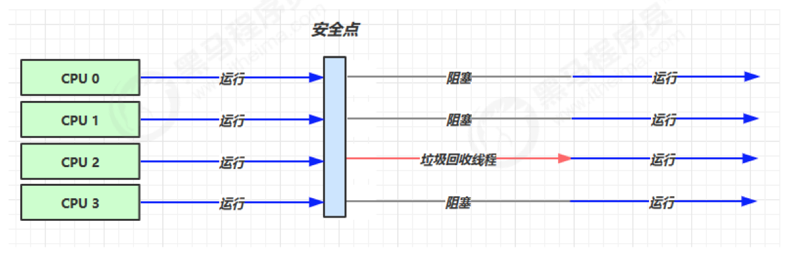
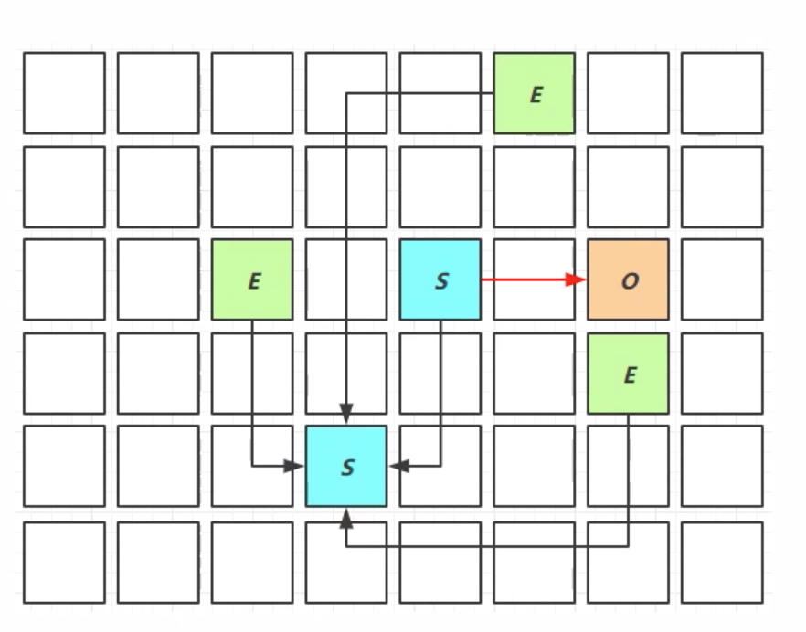
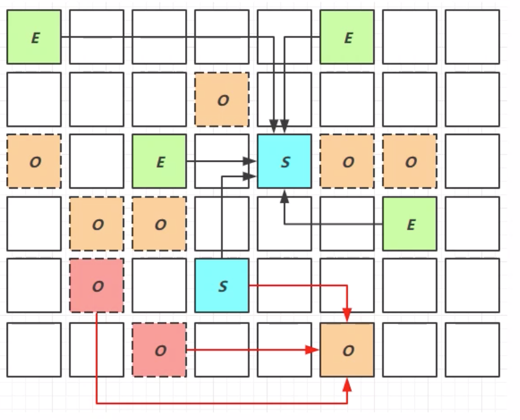

# JVM总结

## 一、内存结构


> 1. 程序计数器
> 2. 虚拟机栈
> 3. 本地方法栈
> 4. 堆
> 5. 方法区

### 1. 程序计数器

#### 定义

Program Counter Register 程序计数器， Register 的命名源于CPU的寄存器，寄存器存储指令相关的现场信息。CPU只有把数据装载到寄存器才能运行。JVM中的PC寄存器是对物理PC寄存器的一种抽象模拟。

**作用：**

- PC寄存器用来存储指向下一条指令的地址，将要执行的指令代码。由执行引擎读取下一条指令。
- 它是一块很小的内存空间，几乎可以忽略不记。也是运行速度最快的存储区域
- 在JVM规范中，每个线程都有它自己的程序计数器，是**线程私有**的，生命周期与线程的生命周期保持一致。
- 任何时间一个线程都只有一个方法在执行，也就是所谓的当前方法。程序计数器会存储当前线程正在执行的java 方法的JVM指令地址；如果执行native 方法，则是未指定值(undefined)
- 字节码解释器工作时就是通过改变这个计数器的值来选取下一条需要执行的字节码指令。
- 是程序控制流的指示器，分支、循环、跳转、异常处理、线程恢复等基础功能都需要依赖这个计数器来完成
- 在JVM规范中没有规定任何OOM情况的区域。


### 2.虚拟机栈

#### 定义

Java Virtual Machine Stacks Java虚拟机栈

- 每个线程只能有一个活动栈桢，对应着正在执行的那个方法
- 它的生命周期与线程相同
- 虚拟机栈描述的是Java方法执行的内存模型
- 每个方法在执行时都会创建一个栈桢（Stack Frame）用于存储局部变量表、操作数栈、动态链接、方法出口等信息
  - 局部变量表存放了编译期可知的各种基本数据类型（boolean、byte、char、short、int、float、long、double）、对象引用（reference类型）
  - 其中64位长度的long和double 类型的数据会占用2个局部变量空间(Slot)，其余的数据只占用1个
  - 局部变量表所需的空间在编译期完成分配，当进入一个方法时，这个方法需要在帧中分配多在的局部变量空间是完全确定的，在方法运行期间不会改变局部变量表的大小 
- 每一个方法从调用直至执行完成的过程，就对应着一个栈桢在虚拟机栈中入栈到出栈的过程。
- 在这个区域规定了两种异常状况
  - 栈桢过多导致内存溢出(StackOverflowError)
  - 栈桢过大导致栈内存溢出(OutOfMemoryError)
- 通过 -Xss 参数可以控制栈大小 (-Xss256K)

**问题**

1、垃圾回收是否涉及栈内存？

答：不涉及，因为栈内存每一次的方法调用结束后会被自动回收掉，所以不需要垃圾回收进行垃圾回收处理

2、栈内存是分配的越大越好吗？

答：不是的，栈内存越大可用线程数就会变小，栈越大会浪费内存。

3、方法内的局部变量是否线程安全？

答：1. 如果方法内局部变量没有逃离方法的作用访问，它是线程安全的

		2. 如果是局部变量引用了对象，并逃离方法的作用范围，需要考虑线程安全

#### 线程运行诊断

1. 线上运行的程序可以使用top 命令查询进程过高的java 程序

2. ps H -eo pid,tid,%cpu | grep 进程id(用ps 命令进一步定位是哪个线程引起的cpu占用过高)
3. jstack 进程id,可以找到有问题的线程id, 进一步定位到问题代码的源码行号

### 3.本地方法栈

#### 定义

Native Method Stack 本地方法栈

- 本地方法栈执行的是Native 方法
- 本地方法栈也会抛出StackOverflowError 和 OutOfMemoryError 异常

### 4.堆

#### 定义

- Java 堆是JVM所管理的内存中最大的一块
- **被所有线程共享的一块内存区域**，在虚拟机启动时创建
- 存储对象实例，通过new关键字，创建对象都会使用堆内存
- 通过-Xmx和-Xms控制堆最大和初始化大小，如果在堆中没有内存完成实例分配，并且堆也无法扩展时，将会抛出OutOfMemoryError异常

#### 堆内存诊断

1. jps 工具：查看当前系统中有哪些java 进程

2. jmap 工具：查看堆内存占用情况 jmap -heap 进程id

3. jconsole 工具：图形界面的，多功能的监测工具，可以连续监测 

   jmc (Java Mission Control) | jvisualvm

### 5. 方法区

#### 定义

方法区与堆一样，是各个线程共享的内存区域，它用于存储已被虚拟机加载的类信息、静态变量、即时编译器编译后的代码等数据。


#### 方法区内存溢出

- 1.8以前会导致永久代内存溢出，OutOfMemoryError 异常

  使用-XX:MaxPermSize 指定上限

- 1.8之后会导致元空间内存溢出， OutOfMemoryError:Metaspace

  使用-XX:MaxMetaspaceSize=8m

### 6. 运行时常量池

- 常量池，就是一张表，虚拟机指令根据这张常量表找到要执行的类名、方法名、参数类型、字面量等信息
- 运行时常量池，常量池是*.class 文件中的，当该类被加载，它的常量池就会放入运行时常量池，并把里面的符号地址变为真实地址

#### StringTable

- 常量池中的字符串仅是符号，第一次用到时才变为对象
- 利用串池的机制，来避免重复创建字符串对象
- 字符串变量拼接的原理是StringBuilder(1.8)
- 字符串常量拼接的原理是编译期优化
- 可以利用intern 方法，主动将串池中还没有的字符串对象放入串池
  - 1.8将这个字符串对象尝试放入串池，如果有则并不会放入，如果没有则放入串池，会把串池中的对象返回
  - 1.6将这个字符串对象尝试放入串池，如果有则并不会放入，如果没有会把此对象复制一份，放入串池，会把串池中的对象返回
- StringTable 性能调优
  - 调整-XX:StringTableSize=桶个数

### 7.直接内存

#### 定义

Direct Memory

- 常见于NIO操作时，用于分配缓冲区
- 分配回收成本较高，但读写性能高
- 不受JVM内存回收管理

#### 分配和回收原理

- 使用了Unsafe 对象完成直接直接内存的分配回收，并且回收需要主动调用freeMemory方法
- ByteBuffer 的实现类内部，使用了Clearner（虚引用）来监测ByteBuffer 对象，一旦ByteBuffer 对象被垃圾回收，那么就会由ReferenceHandler 线程通过Cleaner 的clean 方法调用freeMemory 来释放直接内存。

---

## 二、垃圾回收

### 1. 如何判断对象可以回收

#### 1.1 引用计数法

优点：

1. 实现简单
2. 判断效率高

缺点：

	1. 很难解决对象间循环引用的问题

#### 1.2 可达性分析算法

- java虚拟机中的垃圾回收器采用可达性分析来检索所有存活的对象
- 扫描堆中的对象，看是否能够沿着`GC Root 对象` 为起点的引用链找到该对象，找不到，表示可以回收
- 哪些对象可以作为` GC Root`
  - 虚拟机栈（栈桢中的本地变量表）中引用的对象
  - 方法区中类静态属性引用的对象
  - 方法区中常量引用的对象
  - 方法栈中JNI引用的对象

#### 1.3 四种引用

> 1.强引用 

- 类似“Object ob = new Object()”这类的对象，只要有`GC Roots`对象都没有引用的情况下，该对象才能被垃圾回收

> 2.软引用（SoftReference）

- 用来描述一些还有用但并非必需的对象
- 没有强引用引用该对象，在发生垃圾回收时，内存不足的情况下，会被进行回收
- 可以配合引用队列来释放引用自身

> 3.弱引用（WeakReference）

- 与软引用一样，描述非必需对象的
- 当没有强引用引用该对象时，只要发生垃圾回收，就会被回收掉
- 可以配合引用队列来释放弱引用自身

> 4.虚引用（PhantomReference）

- 必须配合引用队列使用，主要配合ByteBuffer使用，被引用对象回收时会将虚引用入队，由Refercece Handler 线程调用虚引用相关方法释放直接内存

> 5.终结器引用（FinalReference）

- 无需手动编码，但其内部配置引用队列使用，在垃圾回收时，终结器引用入队（被引用对象暂时没有被回收），再由Finalizer 线程通过终结器引用找到被引用对象并调用它的finalize方法，第二次GC时才能回收被引用对象

### 2. 垃圾回收算法

#### 2.1标记清除

定义：MarkSweep

- 算法分为`标记`和`清除`两个阶段，首先需要标记出所有需要回收的对象，在标记完成后统一回收所有被标记的对象

优点：速度较快

缺点：标记清除后会产生大量不连续的内存碎片，空间碎片太多可能会导致以后在程序运行过程中需要分配较大对象时，无法找到足够的连续内存而不得不提前触发另一次垃圾收集动作


#### 2.2标记整理

定义:Mark Compact

与`标记清除`算法一样，但是后续步骤不是直接对可回收对象进行整理，而是让所有存活的对象都向一端进行移动，然后直接清理掉端边界以外的内存


#### 2.3 复制算法

定义：Copy

将可用内存分为两块大小相等的内存块，每次只使用其中一块，当这一块内存用完了，就将还存活的对象复制到另外一块上面，然后再把已使用过的内存空间一次性清理掉。

- 不会产生内存碎片
- 但是内存会缩小到原来的一半
- **现代商业虚拟机都采用这种收集算法回收`新生代`**
  - 新生代将内存分为一块较大的Eden空间和两块较小的Survivor空间，每次使用Eden和其中一块survivor。
  - 当回收时，将Eden 和 survivor 中还存活的对象一次性地复制到另一块Survivor 空间上，最后清理掉Eden和刚才用过的Survivor空间。
  - HotSpot 虚拟机默认Eden和Survivor 的大小比例是8:1,也就是每次新生代中可用内存空间为整个新生代的90%，只有10%的内存会被浪费

### 3.分代垃圾回收

分代垃圾回收算法，根据对象存活周期的不同将内存划分为几块，一般把Java堆分为`新生代`和`老年代`，这样就可以根据各个年代的特点采用最适当的收集算法

- 在新生代中，每次垃圾收集时都发现有大批对象死去，只有少量存活，那就选用`复制算法`，只需要付出少量存活对象的复制成本就可以完成收集。
- 而老年代中，因为对象存活率较高，没有额外空间对它进行分配担保，就必须使用`标记-清除`或`标记-整理`算法来进行回收。


1. 对象首先分配在Eden区域
2. 新生代空间不足时，会触发minor gc，Eden 和from survivor 存活的对象使用`copy`算法复制到to survivor 中，存活的对象年龄 +1 ，并且交换from | to
3. `minor gc` 会引发 `stop the world`，暂停其他用户的线程，等垃圾回收结束，用户线程才恢复运行
4. 当对象寿命超过阈值时，会晋升到`老年代`，最大寿命是15(4bit)
5. 当老年代空间不足时，会尝试触发`minor gc`，如果之后空间仍不足，那么就触发`full gc`，`STW`的时间更长

#### 3.1 相关JVM参数

| 说明               | 参数                                                        |
| ------------------ | ----------------------------------------------------------- |
| 堆初始大小         | -Xms                                                        |
| 堆最大大小         | -Xmx或-XX:MaxHeapSize=size                                  |
| 新生代大小         | -Xmn或(-XX:NewSize=size -XX:MaxNewSize=size)                |
| 幸存区比例（动态） | -XX:InitialSurvivorRatio=ratio和-XX:+UseAdaptiveSizePollicy |
| 幸存区比例         | -XX:SurvivorRatio=ratio                                     |
| 晋升阈值           | -XX:MaxTenuringThreshold=threshold                          |
| 晋升详情           | -XX:+PrintTenuringDistribution                              |
| GC详情             | -XX:+PrintGCDetails -version:gc                             |
| FullGC前MinorGC    | -XX:+ScavengeBeforeFullGC                                   |

### 4.垃圾回收器

**安全点（Safepoint）：**程序在执行时并非在所有地方都能停顿下来开始GC，只在到达安全点时才能暂停。安全点的选定基本上是以程序`是否具有让程序长时间执行的特征`为标准进行选定的。

#### 4.1串行收集器(Serial)

- 一个单线程的收集器
- 在进行垃圾回收时，只会使用一个CPU或一条收集线程去完成垃圾收集工作，必须暂停其他所有的工作线程，直到它收集结束



-XX:+UseSerialGC = Serial + SerialOld

#### 4.2ParNew收集器

Serial 的多线程版本

#### 4.3吞吐量优先

-XX:+UseParallelGC ~ -XX:+UseParallelOldGC

-XX:GCTimeRatio=ratio 吞吐量大小

-XX:MaxGCPauseMillis=ms 控制最大停顿时间 

-XX:ParallelGCThreads=n 限制垃圾收集的线程数


#### 4.4响应时间优先

-XX:+UseConcMarkSweepGC ~ -XX:+UseParNewGC ~ SerialOld

-XX:ParallelGCThreads=n ~ -XXConcGCThreads=threads

-XX:CMSInitiatingOccupancyFraction=percent

-XX:+CMSScavengeBeforeRemark


`初始标记` - `并发标记` - `重新标记`(STW)- `并发清理`

#### 4.5G1

定义：Garbage First

- 2004论文发布
- 2009 JDK 6u14 体验
- 2012 JDK 7u4 官方支持
- 2017 JDK9 默认

适用场景

- 同时注重吞吐量(Throughput)和低延迟(Low latency)，默认的暂停目标是200ms
- 超大堆内存，会将堆划分为多个大小相等的`Region`
- 整体上是`标记+整理`算法，两个区域之间是`复制`算法

相关JVM参数

-XX:+UseG1GC

-XX:G1HeapRegionSize=size

-XX:MaxGcPauseMillis=time

**1) G1垃圾回收阶段**


1. 新生代垃圾回收(Young Collection)
2. 当老年代内存超过一定阈值，会进行(YoungCollection + Concurrent Mark)
3. 当第二步完成后，会执行(Mixed Collection)，会对新生代和老年代进行一次规模较大的收集
4. 这三种垃圾回收阶段是一个循环的过程

**2）Young Collection**

- 会STW

- 新生代内存布局 

- 垃圾回收之前


- 工作一段时间后

  

- 再工作一段时间后

  

**3)Young Collection + CM**

- 在Young GC时会进行GC Root 的初始标记

- 老年代占用堆空间达到阈值时，进行并发标记(不会STW)，由下而的JVM参数决定

  -XX:InitiatingHeapOccupancyPercent=percent（默认45%）

  

**4) Mixed Collection**

会对E、S、O进行全面垃圾回收

- 最终标记(Remark)会STW
- 拷贝存活(Evacuation)会STW

-XX:MaxGCPauseMillis=ms

在回收老年代时，会有选择的对老年代进行复制，复制那些释放空间相对多的区域（优先回收垃圾最多的区域），这样可以减少STW的时间，如果收集时间小于MaxGCPauseMillis 则会将所有收集工作做完。



**5） Full GC**

- SerialGC
  - 新生代内存不足发生的垃圾收集 - minor gc
  - 老年代内存不足发生的垃圾收集 - full gc
- ParallelGC
  - 新生代内存不足发生的垃圾收集 - minor gc
  - 老年代内存不足发生的垃圾收集 - full gc
- CMS
  - 新生代内存不足发生的垃圾收集 - minor gc
  - 老年代内存不足
- G1
  - 新生代内存不足发生的垃圾收集 - minor gc
  - 老年代内存不足
- G1和CMS在老年代内存不足时，如果并发标记线程收集的垃圾快于新生代内存使用的速度，则不会进行full gc
- 反之，如果跟不上新生代产生垃圾的速度，则会退化成SerialOldGC，进行full gc

**6) Young Collection跨代引用**

- 新生代回收的跨代引用(老年代引用新生代)问题

  

- 卡表（老年代）与Remembered Set（老年代引用新生代，新生代记录incoming reference(外部引用)信息）
- 老年代有引用新生代对象的卡表为脏卡(dirty card)
-  标记脏卡
  - 在引用变更时通过`post-write barrier` + `dirty card queue`
  - `concurrent refinement threads`更新`remembered Set`


**7) JDK 8u20字符串去重**

- 优点：节省大量内存
- 缺点：略微多占用了cpu时间，新生代回收时间略微增加

`-XX:+UseStringDeduplication`

```java
String s1 = new String("hello");// char[] {'h', 'e', 'l', 'l', 'o'}
String s2 = new String("hello");// char[] {'h', 'e', 'l', 'l', 'o'}
```

- 将所有新分配的字符串放入一个队列
- 当新生代回收时，G1并发检查是否有字符串重复
- 如果它们值一样，让它们引用同一个char[]
- 注意，与`String.intern()`不一样
  - String.intern()关注的是字符串对象
  - 而字符串去重关注的是char[]
  - 在JVM内部，使用了不同的字符串表

**8) JDK8u40并发标记类卸载**

所有对象都经过并发标记后，就能知道哪些类不再被使用，当一个类加载器的所有类都不再被使用，则卸载它所加载的所有类`-XX:+ClassUnloadingWithConcurrentMark`默认启用

**9) JDK 8u60回收巨型对象**


- 当一个对象大于region的一半时，称为巨型对象
- G1不会对巨型对象进行拷贝
- 回收时被优先考虑
- G1会跟踪老年代所有 incoming引用，这样老年代incoming 引用为0的巨型对象就可以在新生代垃圾回收时处理掉

**10) JDK9并发标记起始时间的调整**

- 并发标记必须在堆空间占满前完成，否则会退货为FullGC
- JDK9之前需要使用-XX:InitiatingHeapOccupancyPercent（默认45%）
- JDK9可以动态调整
  - -XX:InitiatingHeapOccupancyPercent 用来设置初始值
  - 进行数据采样并动态调整
  - 总会添加一个安全的空档空间

### 5.GC调优

预备知识

- 掌握GC相关的VM参数，会基本的空间调整

  ```
  -XX:+PrintFlagsFinal 查看虚拟机运行参数
  
  ```

  

- 掌握相关工具

- 明白一点：调优跟应用、环境有关，没有放之四海而皆准的法则

#### 5.1 调优领域

- 内存
- 锁竞争
- cpu占用
- IO

#### 5.2确定目标

- 【低延迟】还是【高吞吐量】，选择合适的回收器
- CMS, G1, ZGC(高响应时间)
- ParallelGC(高吞吐量)

#### 5.3 最快的GC是不发生GC

- 查看FullGC前后的内存占用，考虑下面几个总是
  - 数据是不是太多？
    - resultSet = statement.query
  - 数据表示是否太臃肿
    - 对象图
    - 对象大小 
  - 是否存在内存泄漏

#### 5.4 新生代调优

- 新生代的特点

  - 所有的ncw操作的内存分配非常廉价
    - TLAB thread-local allocation buffer 减少多线程分配内存时的冲突问题
  - 死亡对象的回收代价是零
  - 大部分对象用过即死
  - MinorGC的时间远远低于FullGC

- 新生代能容纳所有【并发量*(请求-响应)】的数据

- 幸存区大到能保留【当前活跃对象+需要晋升对象】

- 晋升阈值配置得当，让长时间存活对象尽快晋升

  `-XX:MaxTenuringThreshold=threshold`

  -`-XX:+PrintTenuringDistribution`

#### 5.5老年代调优

以CMS为例

- CMS的老年代内存越大越好
- 先尝试不做调优，如果没有FullGC，说明系统比较好，最好先尝试调优新生代
- 观察发生Full GC时老年代内存占用，将老年代内存预设调大1/4 ~ 1/3
- 通过调整参数`-XX:CMSInitiatingOccupancyFraction=percent`当垃圾占用老年代多少比例时进行垃圾回收，值越低，垃圾回收越早


