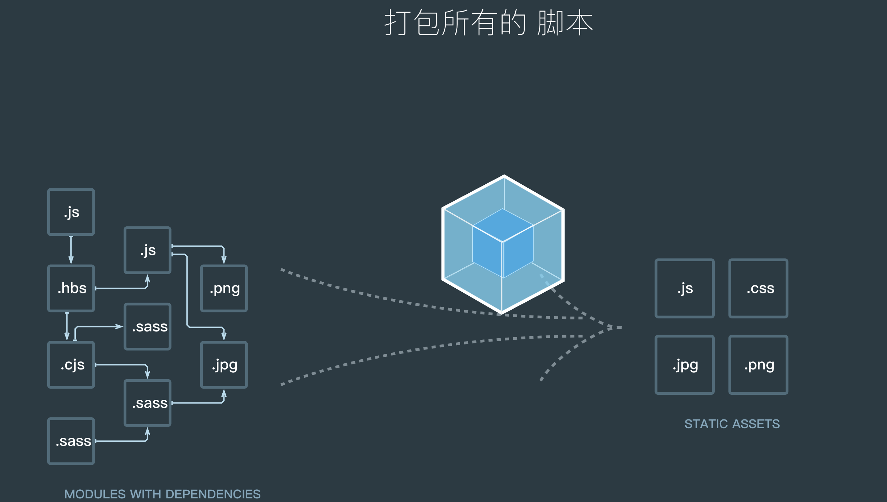

# webpack

> 本学习文档以webpack3.8.1 学习为主，新版本待学会此版本后再做回顾

## 一、入门

### 1-1 前端的发展

Web前端技术从复杂庞大的管理后台到对性能要求苛刻的移动网页，再到类似ReactNative 的原生应用开发方案，Web前端工程师在面临更多机遇的同时也会面临更大的挑战。通过直接编写JavaScript、CSS、HTML开发Web应用的方式已经无法应对当前Web应用的发展。

#### 模块化

模块化是指把一个复杂的系统分解到多个模块以方便编码。

在此之前开发网页的JS文件需要通过命名空间的方式来组织代码，缺点如下：

- 命名空间冲突，两个库可能会使用同一个名称，例如`Zepto`和`jQuery`都被放在`window.$`下；
- 无法合理地管理项目的依赖和版本
- 无法方便地控制依赖的加载顺序

当项目变大时这种方式将变得难以维护，因此需要用模块化的思想来组织代码

#### CommonJS

CommonJS是一种广泛使用的JavaScript模块化规范，核心思想是通过require方法来同步地加载依赖的其他模块，通过`module.exports`导出需要暴露的接口。CommonJS规范的流行得益于Node.js采用了这种方式，后来这种方式被引入到了网页开发中。

采用CommonJS导入及导出的代码如下：

```javascript
// 导入
const moduleA = require('./moduleA')

// 导出
module.exports = moduleA.someFunc;
```

CommonJS的优点在于：

- 代码可复用于Node.js环境下并运行，例如做同构应用；
- 通过NPM发布的很多第三方模块都采用了CommonJS规范。

CommonJS的缺点在于这样的代码无法直接运行在浏览器环境下，必须通过工具转换成标准的ES5。

#### AMD

AMD 也是一种JavaScript 模块化规范，与CommonJS最大的不同在于它***采用异步***的方式去加载依赖的模块。AMD规范主要是为了解决针对***浏览器环境***的模块化问题，最具代表性的实现是`requirejs`。

采用AMD导入及导出时的代码如下：

```javascript
// 定义一个模块
define('module', ['dep'], function(dep) {
  return exports;
})

// 导入和使用
require(['module'], function(module) {
});
```

AMD的优点在于：

- 可在不转换代码的情况下直接在浏览器中运行； 
- 可异步加载依赖；
- 可并行加载多个依赖；
- 代码可运行在浏览器环境和Node.js环境下。
- AMD的缺点在于JavaScript运行环境没有原生支持AMD，需要先导入实现了AMD的库后才能正常使用。

#### ES6 模块化

ES6在语言的层面上实现了模块化。浏览器厂商和Node.js都宣布要原生支持该规范。它将逐渐取代CommonJS和AMD规范，成为浏览器和服务器通用的模块解决方案。

```javascript
// 导入
import { readFile } from 'fs';
import React from 'react';
// 导出
export function hello() {};
export default {
  // ...
};
```

ES6 模块虽然是终极模块化方案，但它的缺点在于目前无法直接运行在大部分JavaScript运行环境下，必须通过工具转换成标准的ES5后才能正常运行。

#### 样式文件中的模块化

除了JavaScript 开始模块化改造，前端开发里的样式文件也支持模块化，以SCSS为例，把一些常用的样式片段放进一个通用的文件里，再在另一个文件里通过`@import`语句导入和使用这些样式片段。

```scss
// util.scss文件 
// 定义样式片段
@mixin center {
  // 水平竖直居中
  position: absolute;
  left: 50%;
  top: 50;
  transform: translate(-50%, -50%);
}

// main.scss 文件 
// 导入和使用util.scss 中定义的样式片段
@import "util";
#box {
  @include center;
}
```

#### 新框架

在Web应用变得庞大复杂时，采用直接操作DOM的方式去开发将会使代码变得复杂和难以维护，许多新思想被引入到网页开发中以减少开发难度、提升开发效率。

##### React

React 框架引入JSX语法到JavaScript语言层面中，以更灵活地控制视图的渲染逻辑。

##### Vue

Vue 框架把一个组件相关的HTML模板，JavaScript逻辑代码、CSS样式代码都写在一个文件里

##### Angular2

Angular2 推崇采用TypeScript语言去开发应用，并且可以通过注解的语法描述组件的各种属性。

#### 新语言

JavaScript 最初被设计用于完成一些简单的工作，在用它开发大型应用时一些语言缺陷会暴露出来。CSS只能用表态的语法描述元素的样式，无法像写JavaScript 那样增加逻辑判断与共享变量。为了解决这些问题，许多新语言诞生了。

##### ES6

ECMAScript 6.0 是JavaScript语言的下一代标准。它在语言层面为JavaScript 引入了许多新语法和API，使得JavaScript 语言可以编写复杂的大型应用程序

- 规范模块化
- Class 语法
- 用`let`声明代码块内有效的变量，用`const`声明常量
- 箭头函数
- async函数
- Set 和 Map数据结构

但遗憾的是不同浏览器对这些特性的支持不一致，使用了这些特性的代码可能会在部分浏览器下无法运行。为了解决兼容性总是，需要把ES6代码转换成ES5代码，Babel是目前解决这个问题最好的工具。Babel的插件机制让它可灵活配置，支持把任何新语法转换成ES5语法。

##### TypeScript

TypeScript 是JavaScript 的一个超集，由Microsoft 开发并开源，除了支持ES6的所有功能，还提供了静态类型检查。采用TypeScript编写的代码可以被编译成符合ES5、ES6标准的JavaScript。将TypeScript用于开发大型项目时，其优点才能体现出来，因为大型项目由多个模块组合而成，不同模块可能又由不同人编写，在对接不同模块时静态类型检查会在编译阶段找出可能存在的问题。TypeScript的缺点在于语法相对于JavaScript更加啰嗦，并且无法直接支持在浏览器或Node.js环境下

##### Flow

Flow也是JavaScript的一个超集，它的主要特点是为JavaScript提供静态类型检查，和TypeScript相似但更灵活，可以让你只在需要的地方加上类型检查。

##### SCSS

SCSS可以让你用程序员的方式写CSS。它是一种CSS预处理器，基本思想是用和CSS相似的编程语言写完后再编译成正常的CSS文件。和SCSS类似的CSS预处理器还有LESS等。

---

使用新语言可以提升编码效率，但是必须把源代码转换成可以直接在浏览器环境下运行的代码。

### 1-2常见的构建工具及对比

在上一节中所提到的新思想和框架，都有一个共同的特点：源代码无法直接运行，必须通过转换后才可以正常运行。***构建***就是做这件事情的，把源代码转换成发布到线上可执行的JavaScript、CSS、HTML代码，包括如下的工作内容

- 代码转换：TypeScript 编译成JavaScript 、SCSS编译成CSS等
- 文件优化：压缩JavaScript、CSS、HTML代码，压缩合并图片等
- 代码分割：提取多个页面的公共代码、提取首屏不需要执行部分的代码让其异步加载。
- 模块合并：在采用模块化的项目里会有很多个模块和文件 ，需要构建功能把模块分类合并成一个文件 
- 自动刷新：监听本地源代码的变化，自动重新构建、刷新浏览器
- 代码校验：在代码被提交到仓库前需要校验代码是否符合规范，以及单元测试是否通过
- 自动发布：更新完代码后，自动构建出线上发布代码并传输给发布系统

构建是工程化、自动化思想在前端开发中的体现，把一系列流程用代码去实现，让代码自动化地执行这一系列复杂的流程。

历史上先后出现过一系列构建工具，各自有其优缺点。由于前端工程师很熟悉JavaScript，Node.js又可以胜任所有构建需求，所以大多数构建工具都是用Node.js开发的。

#### Npm Script

Npm Script 是一个任务执行者。Npm 是在安装Node.js 时附带的包管理器，Npm Script 则是Npm 内置的一个功能，允许在`package.json`文件里面使用`scripts`字段定义任务：

```javascript
{
  "scripts": {
    "dev": "node dev.js"，
    "pub": "node build.js"
  }
}
```

里面的`scripts`字段是一个对象，每个属性对应一段Shell 脚本，其底层实现原理是通过调用Shell 去运行脚本命令，例如执行`npm run pub`命令等同于执行`node build.js`

Npm Script 的优点是内置，无须安装其他依赖，其缺点是功能太简单，虽然提供了`pre`和`post`两个钩子，但不能方便地管理多个任务之间的依赖。

#### Grunt

Grunt 和 Npm Scirpt 类似，也是一个任务执行者。Grunt 有大量现成的插件封装了常见的任务，也能管理任务之间的依赖关系，自动化执行依赖的任务，每个任务的具体执行代码和依赖关系写在配置文件`Gruntfile.js`里

```javascript
module.exports = function(grunt) {
  // 所有插件的配置信息
  grunt.initConfig({
    // uglify 插件的配置信息
    uglify: {
      app_task: {
        files: {
          'build/app.min.js': ['lib/index.js', 'lib/test.js']
        }
      }
    },
    // watch 插件的配置信息
    watch: {
      another: {
          files: ['lib/*.js'],
      }
    }
  });

  // 告诉 grunt 我们将使用这些插件
  grunt.loadNpmTasks('grunt-contrib-uglify');
  grunt.loadNpmTasks('grunt-contrib-watch');

  // 告诉grunt当我们在终端中启动 grunt 时需要执行哪些任务
  grunt.registerTask('dev', ['uglify','watch']);
};
```

在项目根目录下执行命令`grunt dev`就会启动JavaScript 文件压缩和自动刷新功能。

Grunt 的优点是：

- 灵活，它只负责执行你定义的任务
- 大量的可复用插件封装好了常见的构建任务

Grunt 的缺点是集成度不高，要写很多配置后才可以用，无法做到开箱即用。

Grunt 相当于进化版的Npm Script，它的诞生是为了弥补Npm Script 的不足。

#### Gulp

Gulp 是一个基于流的自动化构建工具。除了可以管理和执行任务，还支持监听文件、读写文件。Gulp 被设计得非常简单，只通过下面5个方法就可以胜任几乎所有构建场景：

- 通过`gulp.task`注册一个任务
- 通过`gulp.run`执行任务
- 通过`gulp.watch`监听文件变化
- 通过`gulp.src` 读取文件 
- 通过`gulp.dest`写文件 

Gulp 的最大特点是引入了流的概念，同时提供了一系列常用的插件去处理流，流可以在插件之间传递，使用方式如下：

```javascript
// 引入 Gulp
var gulp = require('gulp'); 
// 引入插件
var jshint = require('gulp-jshint');
var sass = require('gulp-sass');
var concat = require('gulp-concat');
var uglify = require('gulp-uglify');

// 编译 SCSS 任务
gulp.task('sass', function() {
  // 读取文件通过管道喂给插件
  gulp.src('./scss/*.scss')
    // SCSS 插件把 scss 文件编译成 CSS 文件
    .pipe(sass())
    // 输出文件
    .pipe(gulp.dest('./css'));
});

// 合并压缩 JS
gulp.task('scripts', function() {
  gulp.src('./js/*.js')
    .pipe(concat('all.js'))
    .pipe(uglify())
    .pipe(gulp.dest('./dist'));
});

// 监听文件变化
gulp.task('watch', function(){
  // 当 scss 文件被编辑时执行 SCSS 任务
  gulp.watch('./scss/*.scss', ['sass']);
  gulp.watch('./js/*.js', ['scripts']);    
});
```

Gulp 的优点是好用又不失灵活，既可以单独完成构建也可以和其它工具搭配使用。其缺点和Grunt 类似，集成度不高，要写很多配置后才可以用，无法做到开箱即用。

可以将Gulp 看作Grunt 的加强版。相对于Grunt， Gulp 增加了监听文件、读写文件、流式处理的功能。

#### Fis3

Fis3 是一个来自百度的优秀国产构建工具。相对于Grunt、Gulp这些只提供基本功能的工具，Fis3集成了Web开发中的常用构建功能，如下所述。

- 读写文件：通过`fis.match`读取文件，`release`配置文件输出路径
- 资源定位：解析文件之间的依赖关系和文件位置。
- 文件指纹：通过`useHash`配置输出文件时给文件URL加上md5戳来优化浏览器缓存
- 文件编译：通过`parser`配置文件解析器做文件转换，例如把ES6编译成ES5
- 压缩资源：通过`optimizer`配置代码压缩方法。
- 图片合并：通过`spriter`配置合并CSS里导入的图片到一个文件来减少HTTP请求数。

使用方式

```javascript
// 加 md5
fis.match('*.{js,css,png}', {
  useHash: true
});

// fis3-parser-typescript 插件把 TypeScript 文件转换成 JavaScript 文件
fis.match('*.ts', {
  parser: fis.plugin('typescript')
});

// 对 CSS 进行雪碧图合并
fis.match('*.css', {
  // 给匹配到的文件分配属性 `useSprite`
  useSprite: true
});

// 压缩 JavaScript
fis.match('*.js', {
  optimizer: fis.plugin('uglify-js')
});

// 压缩 CSS
fis.match('*.css', {
  optimizer: fis.plugin('clean-css')
});

// 压缩图片
fis.match('*.png', {
  optimizer: fis.plugin('png-compressor')
});
```

Fis3 很强大，内置了许多功能，无须做太多配置就能完成大量工作。Fis3的优点是集成了各种Web开发所需的构建功能，配置简单开箱即用。其缺点是目前官方已经不再更新和维护，不支持最新版本的Node.js。

Fis3是一种专注于Web开发的完整解决方案。

#### Webpack

Webpack是一个打包模块化JavaScript的工具，在Webpack里一切文件皆模块，通过Loader 转换文件，通过Plugin注入钩子，最后输出由多个模块组合成的文件。Webpack专注于构建模块化项目。



一切文件 ：JavaScript、CSS、SCSS、图片、模板，在Webpack眼中都是一个个模块，这样的好处是能清晰的描述出各个模块之间的依赖关系，以方便Webpack对模块进行组合和打包。经过Webpack的处理，最终会输出浏览器能使用的静态资源。

使用如下：

```javascript
module.exports = {
  // 所有模块的入口，Webpack 从入口开始递归解析出所有依赖的模块
  entry: './app.js',
  output: {
    // 把入口所依赖的所有模块打包成一个文件 bundle.js 输出 
    filename: 'bundle.js'
  }
}
```

Webpack的优点是：

- 专注于处理模块化的项目，能做到开箱即用一步到位；
- 通过Plugin扩展，完整好用又不失灵活；
- 使用场景不仅限于Web开发；
- 社区庞大活跃，经常引入紧跟时代发展的新特性，能为大多数场景找到已有的开源扩展
- 良好的开发体验

Webpack的缺点是只能用于采用模块化开发的项目。

#### Rollup

Rollup 是一个和Webpack很类似但专注于ES6的模块打包工具。Rollup的亮点在于能针对ES6源码进行Tree Shaking 以去除那些已被定义但没被使用的代码，以及Scope Hoisting 以减小输出文件大小提升运行性能。然后Rollup的这些亮点随后就被Webpack模仿和实现。

---

#### 为什么选择Webpack?

经过多年的发展， Webpack 已经成为构建工具中的首选，这是有原因的：

- 大多数团队在开发新项目时会采用紧跟时代的技术，这些技术几乎都会采用“模块化+新语言+新框架”，Webpack 可以为这些新项目提供一站式的解决方案；
- Webpack 有良好的生态链和维护团队，能提供良好的开发体验和保证质量；
- Webpack 被全世界的大量 Web 开发者使用和验证，能找到各个层面所需的教程和经验分享。

### 1-3安装Webpack

**安装Webpack到本项目**

```shell
# npm i -D 是 npm install --save-dev 的简写，是指安装模块并保存到 package.json 的 devDependencies
# 安装最新稳定版
npm i -D webpack

# 安装指定版本
npm i -D webpack@<version>

# 安装最新体验版本
npm i -D webpack@beta
```

安装完成后可以通过以下途径运行安装到本项目的Webpack

- 在项目根目录下对应的命令行里通过 `node_modules/.bin/webpack`运行Webpack可执行文件 

  或执行`npx webpack`相当于执行上边的代码

- 在Npm Script 里定义的任务会优先使用本项目下的Webpack

    ```javascript
  "scripts": {
    "start": "webpack --config webpack.config.js"
  }
    ```

**安装Webpack到全局**

安装到全局后你可以在任何地方共用一个webpack可执行文件，而不用各个项目重复安装

```shell
npm i -g webpack
```

推荐安装到当前项目，以防止不同项目依赖不同版本的webpack而导致冲突

**使用Webpack**

Webpack在执行构建时默认会从项目根目录下的`webpack.config.js`文件读取配置

```javascript
const path = require('path');

module.exports = {
  // JavaScript 执行入口文件
  entry: './main.js',
  output: {
    // 把所有依赖的模块合并输出到一个 bundle.js 文件
    filename: 'bundle.js',
    // 输出文件都放到 dist 目录下
    path: path.resolve(__dirname, './dist'),
  }
};
```

由于Webpack构建运行在Node.js环境下，所以该文件最后需要通过CommonJS规范导出一个描述如何构建的`Object`对象。

在项目根目录下执行`npx webpack`命令运行构建，就会生成一个bundle.js 里面包含了两个模块`main.js`和`show.js`以及内置的`webpackBootstrap`启动函数。

Webpack是一个打包模块化JavaScript 的工具，它会从`main.js`出发，识别出源码中的模块化导入语句，递归的寻找出入口文件的所有依赖，把入口和其所有依赖打包到一个单独的文件中。从Webpack2开始，已经内置了对ES6、CommonJS、AMD模块化语句的支持。

### 1-4使用Loader

Webpack不原生支持解析CSS文件。要支持非JavaScript 类型的文件 ，需要使用Webpack的Loader 机制。webpack的配置修改如下：

```javascript
const path = require('path');

module.exports = {
  // JavaScript 执行入口文件
  entry: './main.js',
  output: {
    // 把所有依赖的模块合并输出到一个 bundle.js 文件
    filename: 'bundle.js',
    // 输出文件都放到 dist 目录下
    path: path.resolve(__dirname, './dist'),
  },
  module: {
    rules: [
      {
        // 用正则去匹配要用该 loader 转换的 CSS 文件
        test: /\.css$/,
        use: ['style-loader', 'css-loader?minimize'],
      }
    ]
  }
};
```

Loader 可以看作具有文件转换功能的翻译员，配置里的`module.rules`数组配置了一组规则，告诉Webpack在遇到哪些文件时使用哪些Loader 去加载和转换。如上配置告诉Webpack在遇到以`.css`结尾的文件时先使用`css-loader`读取文件，再交给`style-loader`把CSS内容注入到JavaScript 里。在配置Loader 时需要注意：

- `use`属性的值需要是一个由Loader 名称组成的数组，Loader 的执行顺序是***由后到前的***；
- 每个Loader 都可以通过URL querystring 的方式传入参数，例如`css-loader?minimize`中的`minimize`告诉`css-loader`要开启CSS压缩

在重新执行webpack构建前需要先安装新引入的Loader

```shell
npm i -D style-loader css-loader
```

重新构建后，`bundle.js`文件被更新，里面注入了css内容，这其实是`style-loader`的功劳，它的工作原理大概是把CSS内容用JavaScript里的字符串存储起来，在网页执行JavaScript时通过DOM操作动态地往HTML head 标签里插入HTML style 标签

给Loader 传入属性的方式除了有querystring 外，还可以通过Object 传入，以上的Loader 配置可以修改为如下：

```javascript
use: [
  'style-loader', 
  {
    loader:'css-loader',
    options:{
      minimize:true,
    }
  }
]
```

除了在`webpack.config.js`配置文件中配置Loader 外，还可以在源码中指定用什么Loader 去处理文件。以加载CSS文件为例：

```javascript
require('style-loader!css-loader?minimize!./main.css');
```

这样就能指定对./main.css 这个文件先采用css-loader再采用style-loader转换。

### 1-5使用Plugin

Plugin 是用来扩展Webpack功能的，通过在构建流程里注入钩子实现，它给Webpack带来了很大的灵活性。

将上一节的CSS文件的提取取单独的文件中，配置如下：

```javascript
const path = require('path');
const ExtractTextPlugin = require('extract-text-webpack-plugin');

module.exports = {
  // JavaScript 执行入口文件
  entry: './main.js',
  output: {
    // 把所有依赖的模块合并输出到一个 bundle.js 文件
    filename: 'bundle.js',
    // 把输出文件都放到 dist 目录下
    path: path.resolve(__dirname, './dist'),
  },
  module: {
    rules: [
      {
        // 用正则去匹配要用该 loader 转换的 CSS 文件
        test: /\.css$/,
        use: ExtractTextPlugin.extract({
          // 转换 .css 文件需要使用的 Loader
          use: ['css-loader'],
        }),
      }
    ]
  },
  plugins: [
    new ExtractTextPlugin({
      // 从 .js 文件中提取出来的 .css 文件的名称
      filename: `[name]_[contenthash:8].css`,
    }),
  ]
};
```

需要安装新引入的插件

```shell
npm i -D extract-text-webpack-plugin
```

重新构建后，会发现css 已经变成了一个单独的文件，在index.html中重新加入css 的引用即可。

Webpack是通过`plugins`属性来配置需要使用的插件列表的。`plugins`属性是一个数组，里面的每一项都是插件的一个实例，在实例化一个组件时可以通过构造函数传入这个组件支持的配置属性。

### 1-6使用 DevServer

前面的几节只是让Webpack正常运行起来，但在实际开发中你可能会需要：

1. 提供HTTP服务而不是使用本地文件预览
2. 监听文件的变化并自动刷新网页，做到实时预览
3. 支持SourceMap，以方便调试

对于这些，官方提供的开发工具DevServer 可以很方便的做到，DevServer会启动一个Http服务器用于服务网页请求，同时会启动Webpack, 并接收Webpack发出的文件变更信号，通过WebSocket 协议自动刷新网页做到实时预览

为之前的项目安装WebpackDevServer

```shell
npm i -D webpack-dev-server
```

安装成功后执行`webpack-dev-server`命令，DevServer 就启动了，DevServer 启动后会一直驻留在后台保持运行，但是这时用浏览器访问地址，会报404找不到./dist/bundle.js的错误，原因是DevServer 会把Webpack构建出的文件保存在内存中，在要访问输出的文件时，必须通过HTTP服务访问。由于DevServer 不会理会webpack.config.js里配置的output.path属性，所以要获取bundle.js 的正确URL是http://localhost:8080/bundle.js，对应的index.html 同时需要进行修改。

**实时预览**

webpack在启动时可以开启监听模式，开启监听模式后webpack会监听本地文件系统的变化，发生变化时重新构建出新的结果。webpack默认是关闭监听模式的，你可以在启动webpack时通过`webpack --watch`来开启监听模式。

通过DevServer 启动的webpack会开启监听模式，当发生变化时重新执行完构建后通知DevServer。DevServer 会让webpack 在构建出的JavaScript代码里注入一个代理客户端用于控制网页，网页和DevServer之间通过websocket 协议通信，以方便DevServer主动向客户端发送命令。DevServer 在收到来自webpack的文件变化通知时通过注入的客户端控制见面刷新。

>**注：**如果尝试修改index.html文件并保存，不会触发上述的机制，导致这个问题的原因是webpack在启动时会以配置里的entry为入口去递归解析出entry所依赖的文件，只有entry本身和依赖的文件才会被webpack添加到监听列表里，而index.html 文件是脱离了JavaScript模块化系统的，所以webpack不知道它的存在。

**模块热替换**

除了通过重新刷新整个网页来实现实时预览，DevServer 还有一种被称为模块热替换的刷新技术。模块热替换能做到在不重新加载整个网页的情况下，通过将被更新过的模块替换老的模块，再重新执行一次来实现实时预览。模块热替换相对于默认的刷新机制能提供更快的响应和更好的开发体验。模块热替换默认是关闭的，要开启模块热替换，只需要在启动DevServer时带上`--hot`参数，重启DevServer 后再去更新文件就能体验到模块热替换了。


- fyi

