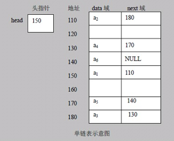
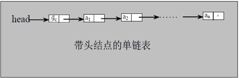
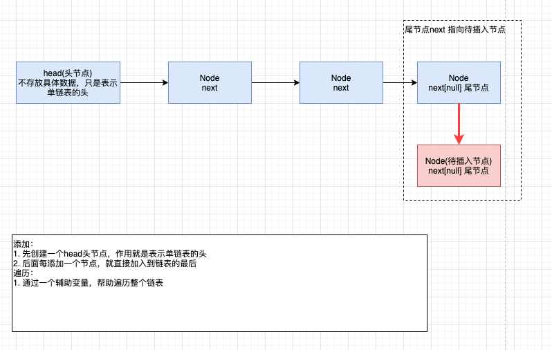
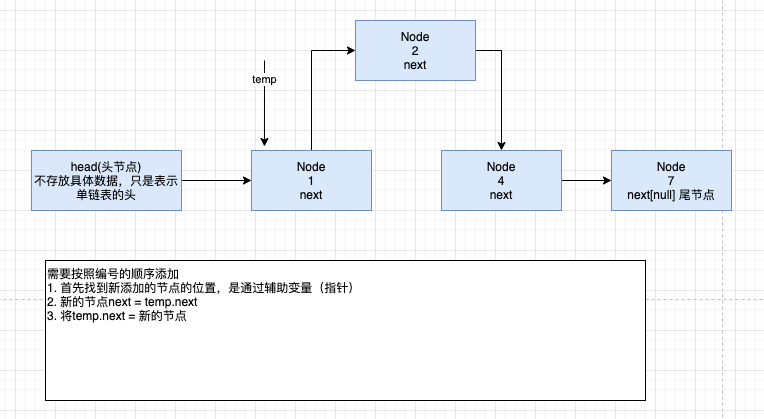
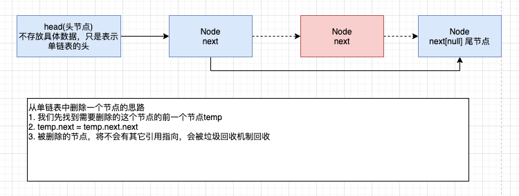
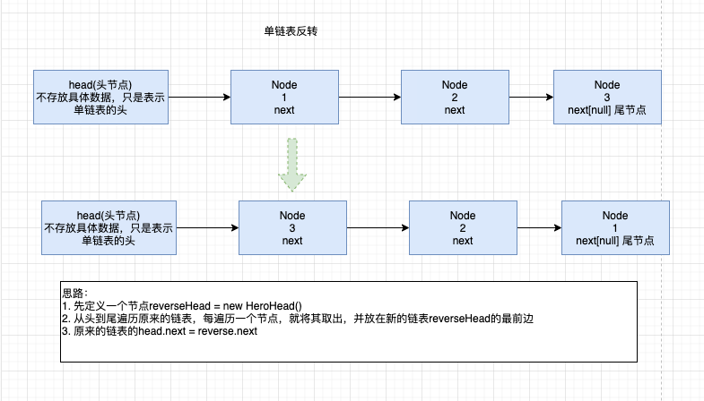
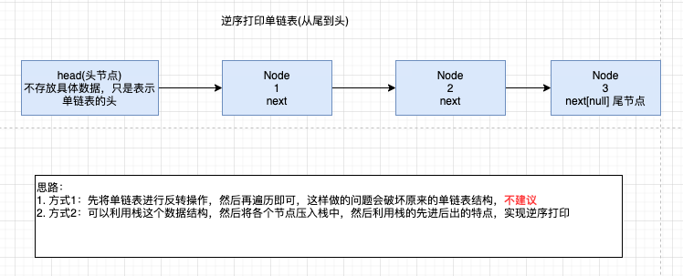
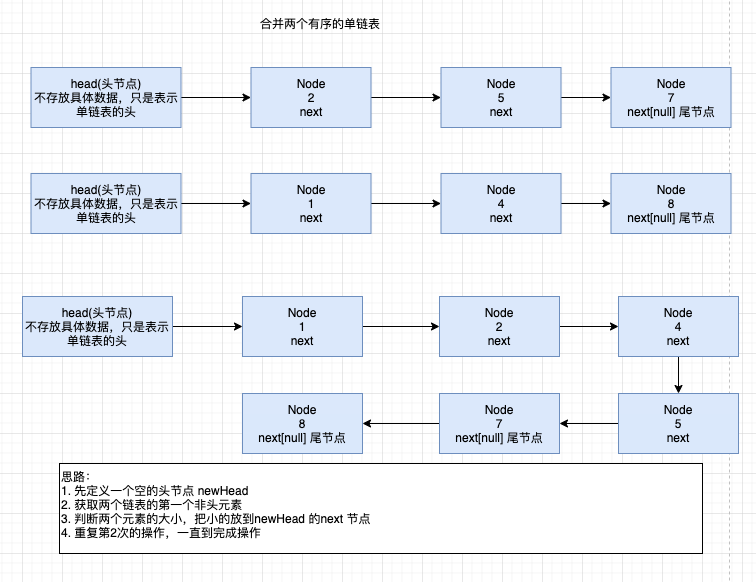

# Java数据结构与算法

## 一、数据结构与算法概述

### 1.1 线性结构

1. 线性结构作为最常用的数据结构，其特点是**数据元素之间存在一对一**的线性关系
2. 线性结构有两种不同的存储结构，即**顺序存储结构（数组）**和**链式存储结构（链表）**。顺序存储的线性表称为顺序表，顺序表中的存储元素是连续的。
3. 链式存储的线性表称为链表，链表中的**存储元素不一定是连续的**，元素节点中存放数据元素以及相邻元素的地址信息。
4. 线性结构常见的有：**数组、队列、链表和栈**。

### 1.2 非线性结构

非线性结构包括：二维数组、多维数组、广义表、树结构、图结构

## 二、稀疏数组与队列

### 2.1 稀疏数组

#### 2.1.1 需要解决的问题


#### 2.1.2 基本介绍

>当一个数组中大部分元素为0，或者为同一个值的数组时，可以使用稀疏数组来保存该数组。
>
>稀疏数组的处理方法：
>
>1. 记录数组一共有几行几列，有多少个不同的值
>2. 把具有不同值的元素的行列及值记录在一个小规模的数组中，从而缩小程序的规模。

#### 2.1.4 案例


#### 2.1.4 思路分析


#### 2.1.5 代码实现

```java
package com.fs.sparse.array;

/**
 * 稀疏数组
 * @author fangshuai
 * @version 1.0 2021/05/11
 */
public class SparseArray {

    public static void main(String[] args) {
        // 创建一个原始的二维数组 11 * 11
        // 0: 表示没有棋子  1: 表示黑子  2: 表示蓝子
        int chessArr1[][] = new int[11][11];
        chessArr1[1][2] = 1;
        chessArr1[2][3] = 2;

        // 输出原始的二维数组
        System.out.println("原始的二维数组");
        printArray(chessArr1);

        // 将二维数组转化为稀疏数组
        // 获取二维数组有值的个数
        int sum = getSum(chessArr1);
        int[][] sparseArr = new int[sum + 1][3];
        sparseArr[0][0] = chessArr1.length;
        sparseArr[0][1] = chessArr1[0].length;
        sparseArr[0][2] = sum;
        int row = 1;
        for (int i = 0; i < chessArr1.length; i++) {
            for (int j = 0; j < chessArr1[i].length; j++) {
                if (chessArr1[i][j] > 0) {
                    sparseArr[row][0] = i;
                    sparseArr[row][1] = j;
                    sparseArr[row][2] = chessArr1[i][j];
                    row += 1;
                }
            }
        }
        System.out.println("转换稀疏数组完成");
        printArray(sparseArr);

        // 将稀疏数组转为二维数组
        int[][] rawArr = new int[sparseArr[0][0]][sparseArr[0][1]];
        for (int i = 1; i < sparseArr.length; i++) {
            rawArr[sparseArr[i][0]][sparseArr[i][1]] = sparseArr[i][2];
        }
        System.out.println("还原二维数组完成");
        printArray(rawArr);
    }

    private static int getSum(int[][] arr) {
        int sum = 0;
        for (int i = 0; i < arr.length; i++) {
            for (int j = 0; j < arr[i].length; j++) {
                if (arr[i][j] > 0) {
                    sum += 1;
                }
            }
        }
        return sum;
    }

    private static void printArray(int[][] arr) {
        for (int i = 0; i < arr.length; i++) {
            for (int j = 0; j < arr[i].length; j++) {
                System.out.printf("%d\t", arr[i][j]);
            }
            System.out.println();
        }
    }
}

```

### 2.2 队列

#### 2.2.1 队列介绍

> - 队列是一个有序列表，可以用数组或是链表来实现
> - 遵循先入先出的原则。即：先存入队列的数据，要先取出。后存入的要后取出

#### 2.2.2 模拟数组队列 - 代码实现

```java
package com.fs.queue;

import java.util.Scanner;

/**
 * @author fangshuai
 * @version 1.0 2021/05/12
 */
public class ArrayQueueDemo {

//    public static void main(String[] args) {
//        ArrayQueue arrayQueue = new ArrayQueue(4);
//        arrayQueue.addQueue(4);
//        arrayQueue.addQueue(5);
//        arrayQueue.addQueue(6);
//        arrayQueue.addQueue(7);
//        arrayQueue.show();
//        System.out.println("从队列取数据: " + arrayQueue.getQueue());
//        System.out.println("从队列取数据: " + arrayQueue.getQueue());
//        System.out.println("从队列取数据: " + arrayQueue.getQueue());
//        arrayQueue.show();
//        arrayQueue.showHeadQueue();
//        System.out.println("从队列取数据: " + arrayQueue.getQueue());
//        arrayQueue.showHeadQueue();
//        arrayQueue.show();
//    }

    public static void main(String[] args) {
        ArrayQueue arrayQueue = new ArrayQueue(4);
        // 接收用户输入
        char key = ' ';
        Scanner scanner = new Scanner(System.in);
        boolean loop = true;
        while (loop) {
            System.out.println("s(show): 显示队列");
            System.out.println("e(exit): 退出程序");
            System.out.println("a(add): 添加数据到队列");
            System.out.println("g(get): 从队列取出数据");
            System.out.println("h(head): 显示队列头的数据");
            key = scanner.next().charAt(0);
            switch (key) {
                case 's':
                    arrayQueue.show();
                    break;
                case 'a':
                    System.out.println("请输入一个数");
                    int value = scanner.nextInt();
                    arrayQueue.addQueue(value);
                    break;
                case 'e':
                    scanner.close();
                    loop = false;
                case 'g':
                    try {
                        int head = arrayQueue.getQueue();
                        System.out.println("取出的数据：" + head);
                    } catch (Exception e) {
                        System.out.println(e.getMessage());
                    }
                    break;
                case 'h':
                    try {
                        System.out.println("当前队列头数据: " + arrayQueue.showHeadQueue());
                    } catch (Exception e) {
                        System.out.println(e.getMessage());
                    }
                    break;
                default:
                    break;
            }
        }
    }

}

/**
 * 使用数组模拟队列 - 编写一个ArrayQueue类
 */
class ArrayQueue {

    /**
     * 表示数组的最大容量
     */
    private int maxSize;

    /**
     * 队列头
     */
    private int front;

    /**
     * 队列尾
     */
    private int rear;

    /**
     * 该数据用于存储数据，模拟队列
     */
    private int[] arr;

    public ArrayQueue(int maxSize) {
        this.maxSize = maxSize;
        this.arr = new int[maxSize];
        // 指向队列头部前一个位置
        this.front = -1;
        // 指向队列尾部的具体数据
        this.rear = -1;
    }

    /**
     * 判断队列是否已满
     * @return
     */
    public boolean isFull() {
        return this.rear == this.maxSize - 1;
    }

    /**
     * 判断队列是否为空
     * @return
     */
    public boolean isEmpty() {
        return this.rear == this.front;
    }

    /**
     * 添加数据
     * @param n
     */
    public void addQueue(int n) {
        if (isFull()) {
            System.out.println("队列满，不能加入数据");
            return;
        }
        this.rear += 1;
        this.arr[this.rear] = n;
    }

    /**
     * 数据出队
     */
    public int getQueue() {
        if (isEmpty()) {
            System.out.println("队列为空，不能获取数据");
            throw new RuntimeException("队列为空，不能获取数据");
        }
        this.front += 1;
        return this.arr[this.front];
    }

    /**
     * 显示
     */
    public void show() {
        if (isEmpty()) {
            System.out.println("队列为空，没有数据");
            return;
        }
        for (int i = 0; i < this.arr.length; i++) {
            System.out.printf("arr[%d]=%d\n", i, this.arr[i]);
        }
    }

    /**
     * 显示头部数据
     */
    public int showHeadQueue() {
        if (isEmpty()) {
            System.out.println("队列为空，没有数据");
            throw new RuntimeException("队列为空，不能获取数据");
        }
        System.out.println("当前头部数据:" + this.arr[this.front + 1]);
        return this.arr[this.front + 1];
    }
}
```

- 问题分析并优化
  1. 目前数组使用一次就不能再次使用，数组没有达到复用
  2. 改进：将这个数组使用算法，改进成一个环形的数组，采用取模（%）方式完成

#### 2.2.3 数组模拟环形队列

对前面的数组模拟队列的优化，充分利用数组。因此将数组看做是一个环形的。（通过**取模的方式来实现**）

**分析说明：**

1. 尾索引的下一个为头索引时表示队列满，即将队列容量空出一个作为约定，这个在做判断队列满的时候需要注意(rear + 1) % maxSize == front (满)
2. rear == front (空)
3. 分析示意图


##### 2.2.3.1 数组模拟环形队列-代码实现

```java
package com.fs.queue;

import java.util.Scanner;

/**
 * @author fangshuai
 * @version 1.0 2021/07/27
 */
public class CircleArrayQueueDemo {

    public static void main(String[] args) {
        CircleArray circleArray = new CircleArray(4);
        // 接收用户输入
        char key = ' ';
        Scanner scanner = new Scanner(System.in);
        boolean loop = true;
        while (loop) {
            System.out.println("s(show): 显示队列");
            System.out.println("e(exit): 退出程序");
            System.out.println("a(add): 添加数据到队列");
            System.out.println("g(get): 从队列取出数据");
            System.out.println("h(head): 显示队列头的数据");
            key = scanner.next().charAt(0);
            switch (key) {
                case 's':
                    circleArray.show();
                    break;
                case 'a':
                    System.out.println("请输入一个数");
                    int value = scanner.nextInt();
                    circleArray.addQueue(value);
                    break;
                case 'e':
                    scanner.close();
                    loop = false;
                case 'g':
                    try {
                        int head = circleArray.getQueue();
                        System.out.println("取出的数据：" + head);
                    } catch (Exception e) {
                        System.out.println(e.getMessage());
                    }
                    break;
                case 'h':
                    try {
                        System.out.println("当前队列头数据: " + circleArray.headQueue());
                    } catch (Exception e) {
                        System.out.println(e.getMessage());
                    }
                    break;
                default:
                    break;
            }
        }
    }

}

class CircleArray {

    /**
     * 表示数组的最大容量
     */
    private int maxSize;

    /**
     * front 变量的含义做一个调整：front就指向队列的第一个元素，也就是说arr[front]就是队列的第一个元素, front 的初始值为0
     */
    private int front;

    /**
     * rear变量的含义做一个调整：rear指向队列的最后一个元素的后一个位置。因为希望空出一个空间作为约定，rear 的初始值为0
     */
    private int rear;

    /**
     * 该数据用于存放数据，模拟队列
     */
    private int[] arr;

    public CircleArray(int arrayMaxSize) {
        this.maxSize = arrayMaxSize;
        this.arr = new int[this.maxSize];
    }

    /**
     * 判断队列是否已满
     * @return
     */
    public boolean isFull() {
        return (rear + 1) % maxSize == front;
    }

    /**
     * 判断队列是否为空
     * @return
     */
    public boolean isEmpty() {
        return rear == front;
    }

    /**
     * 添加数据到队列
     * @param n
     */
    public void addQueue(int n) {
        // 判断队列是否满
        if (isFull()) {
            System.out.println("队列满, 不能加入数据");
            return;
        }
        // 直接将数据加入
        arr[rear] = n;
        // 将rear 后移，必须考虑rear 取模
        rear = (rear + 1) % maxSize;
    }

    /**
     * 取数据
     * @return
     */
    public int getQueue() {
        // 判断队列是否为空
        if (isEmpty()) {
            throw new RuntimeException("队列空, 不能取数据");
        }
        // 这里需要分析出front是指向队列的第一个元素
        // 1. 先把front对应的值保留到一个临时变量
        // 2. 将front 后移
        // 3. 将临时保存的变量返回
        int n = arr[front];
        front = (front + 1) % maxSize;
        return n;
    }

    /**
     * 显示队列所有数据
     */
    public void show() {
        if (isEmpty()) {
            System.out.println("队列空的， 没有数据");
            return;
        }
        // 思路：从front 开始遍历, 遍历多少个元素
        for (int i = front; i < front + getSize(); i++) {
            System.out.printf("arr[%d]=%d\n", i % maxSize, arr[i % maxSize]);
        }
    }

    /**
     * 获取队列元素个数
     * @return
     */
    public int getSize() {
        return (rear + maxSize - front) % maxSize;
    }

    /**
     * 获取队列头数据，不取出
     * @return
     */
    public int headQueue() {
        return arr[front];
    }
}

```

## 三、链表

### 3.1 链表（LinkedList）介绍

链表是有序的列表，在内存中存储如下



1. 链表以节点的方式来存储，**链式存储**
2. 每个节点包含data域，next 域（指向下一个节点）
3. 链表的各个节点不一定是连续存储
4. 链表分**带头节点的链表**和**没有头节点的链表**，根据实际的需求来确定

单链表（带头结点）**逻辑结构**示意图如下



### 3.2 单链表的应用实例

使用带head头的单向链表实现 - 水浒英雄排行榜管理完成对英雄人物的增删改查操作

1. 第一种 方法在添加英雄时，直接添加到链表的尾部



2. 第二种方式在添加英雄时，**根据排名**将英雄插入到指定位置（如果有这个排名，则添加失败）



3. 修改节点功能

- 先找到该节点
- temp.name = newHeroNode.name

4. 删除节点



#### 3.2.1 代码实现

```java
package com.fs.linkedlist;

/**
 * @author fangshuai
 * @version 1.0 2021/07/28
 */
public class SingleLinkedListDemo {

    public static void main(String[] args) {
        HeroNode hero1 = new HeroNode(1, "宋江", "及时雨");
        HeroNode hero2 = new HeroNode(2, "卢俊义", "玉麒麟");
        HeroNode hero3 = new HeroNode(3, "吴用", "智多星");
        HeroNode hero4 = new HeroNode(4, "林冲", "豹子头");

//        SingleLinkedList singleLinkedList = new SingleLinkedList();
//        singleLinkedList.add(hero1);
//        singleLinkedList.add(hero2);
//        singleLinkedList.add(hero3);
//        singleLinkedList.add(hero4);
//        singleLinkedList.show();

        SingleLinkedList singleLinkedList = new SingleLinkedList();
        singleLinkedList.addByOrder(hero1);
        singleLinkedList.addByOrder(hero3);
        singleLinkedList.addByOrder(hero2);
        singleLinkedList.addByOrder(hero4);
        singleLinkedList.addByOrder(hero2);
        singleLinkedList.show();

        System.out.println("修改之后的情况");
        HeroNode hero2UpdateNode = new HeroNode(2, "11", "22");
        singleLinkedList.update(hero2UpdateNode);

        System.out.println("删除后的情况");
        singleLinkedList.delete(4);

        singleLinkedList.show();
    }

}

/**
 * 单链表
 */
class SingleLinkedList {

    /**
     * 初始化一个头节点，头节点不动，不存放具体的数据
     */
    private HeroNode head = new HeroNode(0, "", "");

    /**
     * 添加节点到单向链表
     * 1. 找到当前链表的最后节点
     * 2. 将最后这个节点的next指向新的节点
     * @param heroNode
     */
    public void add(HeroNode heroNode) {
        HeroNode temp = head;
        // 遍历链表，找到最后节点
        while (true) {
            if (temp.next == null) {
                break;
            }
            temp = temp.next;
        }
        // 当退出while 循环时，temp 就指向了链表的最后
        temp.next = heroNode;
    }

    /**
     * 添加节点到单向链表
     * 按序插入
     * @param heroNode
     */
    public void addByOrder(HeroNode heroNode) {
        // 因为是单链表，所以我们找的temp是位于添加位置的前一个节点
        HeroNode temp = head;
        // 标识添加的编号是否存在
        boolean flag = false;
        while (true) {
            // 说明 temp 已经在链表最后
            if (temp.next == null) {
                break;
            }
            // 位置找到了
            if (temp.next.no > heroNode.no) {
                break;
            }
            // 说明将要添加的heroNode编号已经存在
            else if (temp.next.no == heroNode.no) {
                flag = true;
                break;
            }
            temp = temp.next;
        }
        if (flag) {
            System.out.printf("已存在相同编号节点, %d\n", heroNode.no);
            return;
        }
        heroNode.next = temp.next;
        temp.next = heroNode;
    }

    /**
     * 修改节点的信息，根据no编号来修改，即no编号不能改
     * 1. 根据newHeroNode的no来修改即可
     * @param newHeroNode
     */
    public void update(HeroNode newHeroNode) {
        // 判断是否空
        if (head.next == null) {
            System.out.println("链表为空");
            return;
        }
        // 是否找到的标志
        boolean flag = false;
        // 找到需要修改的节点
        HeroNode temp = head.next;
        while (true) {
            if (temp.no == newHeroNode.no) {
                flag = true;
                break;
            }
            temp = temp.next;
        }
        if (flag) {
            temp.name = newHeroNode.name;
            temp.nickName = newHeroNode.nickName;
        } else {
            System.out.printf("未找到编号为 %d 的节点", newHeroNode.no);
        }
    }

    /**
     * 删除节点
     * @param no
     */
    public void delete(int no) {
        HeroNode temp = head;
        // 标识是否找到待删除节点
        boolean flag = false;
        while (true) {
            if (temp.next == null) {
                break;
            }
            if (temp.next.no == no) {
                flag = true;
                break;
            }
            temp = temp.next;
        }
        if (flag) {
            temp.next = temp.next.next;
        } else {
            System.out.printf("未找到编号为 %d 的节点", no);
        }
    }

    /**
     * 显示链表
     */
    public void show() {
        // 判断链表是否为空
        if (head.next == null) {
            System.out.println("链表为空");
            return;
        }

        HeroNode temp = head.next;
        while (true) {
            System.out.println(temp);
            temp = temp.next;
            if (temp == null) {
                break;
            }
        }
    }

}

class HeroNode {
    public int no;
    public String name;
    public String nickName;
    /**
     * 指向下一个节点
     */
    public HeroNode next;

    public HeroNode(int no, String name, String nickName) {
        this.no = no;
        this.name = name;
        this.nickName = nickName;
    }

    @Override
    public String toString() {
        return "HeroNode{" +
                "no=" + no +
                ", name='" + name + '\'' +
                ", nickName='" + nickName + '\'' +
                '}';
    }
}

```

### 3.3 单链表面试题

1. 求单链表中有效节点的个数

```java
public int size() {
        if (head.next == null) {
            return 0;
        }
        int size = 0;
        HeroNode temp = head.next;
        while (temp != null) {
            size += 1;
            temp = temp.next;
        }
        return size;
    }
```

2. 查找单链表中倒数第k个结点

```java
/**
     * 查找单链表中倒数第K个结点
     * 1. 编写一个方法，接收head节点，同时接收一个index
     * 2. index 表示是倒数第index 个节点
     * 3. 先把链表从头到尾遍历，得到链表的总的长度size
     * 4. 得到size后，我们从链表的第一个开始遍历(size - index)个，就可以得到
     * 5. 如果找到了，则返回该节点，否则返回 null
     * @param singleLinkedList
     * @param index
     * @return
     */
    public static HeroNode findIndexNode(SingleLinkedList singleLinkedList, int index) {
        // 如果为空链表直接返回null
        HeroNode head = singleLinkedList.getHead();
        if (head.next == null) {
            return null;
        }

        int size = singleLinkedList.size();
        if (index <=0 || index > size) {
            return null;
        }
        int nodeIndex = size - index;
        HeroNode temp = head.next;
        for (int i = 0; i < nodeIndex; i++) {
            temp = temp.next;
        }
        return temp;
    }
```

3. 单链表的反转



```java
/**
     * 将单链表反转
     * @param singleLinkedList
     */
    public static void reverse(SingleLinkedList singleLinkedList) {
        HeroNode head = singleLinkedList.getHead();
        // 如果当前链表为空，或者只有一个节点，无需反转
        if (head.next == null || head.next.next == null) {
            return;
        }
        HeroNode reverseNode = new HeroNode(0, "", "");
        HeroNode tmp = head.next;
        while (true) {
            // 将原链表的头指向第一个节点的下一个节点
            head.next = tmp.next;
            tmp.next = reverseNode.next;
            reverseNode.next = tmp;
            // 第次获取排在最前的元素
            if (head.next == null) {
                break;
            }
            tmp = head.next;
        }

        head.next = reverseNode.next;
    }
```

4. 从尾到头打印单链表



```java
/**
     * 逆序打印
     */
    public void reverseShow() {
        // 判断链表是否为空
        if (head.next == null) {
            System.out.println("链表为空");
            return;
        }

        Stack<HeroNode> stack = new Stack<>();
        HeroNode tmp = head.next;
        while (true) {
            stack.push(tmp);
            tmp = tmp.next;
            if (tmp == null) {
                break;
            }
        }
        while (stack.size() > 0) {
            System.out.println(stack.pop());
        }
    }
```

5. 合并两个有序的单链表，合并之后的链表依然有序



```java
package com.fs.linkedlist;

/**
 * 合并两个有序的单链表, 合并之后的链表依然有序
 * @author fangshuai
 * @version 1.0 2021/07/28
 */
public class CombineLinkedListDemo {

    public static void main(String[] args) {
        SingleLinkedList s1 = getSingleLinkedList1();
        SingleLinkedList s2 = getSingleLinkedList2();
        SingleLinkedList result = combineLinkedList(s1, s2);
        result.show();
    }

    private static SingleLinkedList combineLinkedList(SingleLinkedList s1, SingleLinkedList s2) {
        HeroNode s1Head = s1.getHead();
        HeroNode s2Head = s2.getHead();
        if (s1Head.next == null) {
            return s2;
        }
        if (s2Head.next == null) {
            return s1;
        }
        SingleLinkedList result = new SingleLinkedList();
        HeroNode s1Node = s1Head.next;
        HeroNode s2Node = s2Head.next;
        while (true) {
            if (s1Node.no < s2Node.no) {
                s1Head.next = s1Node.next;
                s1Node.next = null;
                result.add(s1Node);
                s1Node = s1Head.next;
            } else if (s1Node.no > s2Node.no) {
                s2Head.next = s2Node.next;
                s2Node.next = null;
                result.add(s2Node);
                s2Node = s2Head.next;
            }
            // 相等的情况下，只取一个，另一个值需要舍弃
            else {
                s1Node.next = null;
                result.add(s1Node);
                s1Node = s1Head.next;
                s2Node = s2Head.next;
            }
            if (s1Node == null && s2Node != null) {
                result.add(s2Node);
                s2Node = null;
            } else if (s1Node != null && s2Node == null) {
                result.add(s1Node);
                s1Node = null;
            }
            if (s1Node == null && s2Node == null) {
                break;
            }
        }
        return result;
    }

    private static SingleLinkedList getSingleLinkedList1() {
        HeroNode hero1 = new HeroNode(1, "宋江", "及时雨");
        HeroNode hero2 = new HeroNode(3, "卢俊义", "玉麒麟");
        HeroNode hero3 = new HeroNode(6, "吴用", "智多星");
        HeroNode hero4 = new HeroNode(9, "林冲", "豹子头");

        SingleLinkedList singleLinkedList1 = new SingleLinkedList();
        singleLinkedList1.addByOrder(hero1);
        singleLinkedList1.addByOrder(hero2);
        singleLinkedList1.addByOrder(hero3);
        singleLinkedList1.addByOrder(hero4);
        return singleLinkedList1;
    }

    private static SingleLinkedList getSingleLinkedList2() {
        HeroNode hero1 = new HeroNode(4, "宋江", "及时雨");
        HeroNode hero2 = new HeroNode(5, "卢俊义", "玉麒麟");
        HeroNode hero3 = new HeroNode(7, "吴用", "智多星");
        HeroNode hero4 = new HeroNode(10, "林冲", "豹子头");
        HeroNode hero5 = new HeroNode(12, "林冲", "豹子头");
        HeroNode hero6 = new HeroNode(14, "林冲", "豹子头");

        SingleLinkedList singleLinkedList2 = new SingleLinkedList();
        singleLinkedList2.addByOrder(hero1);
        singleLinkedList2.addByOrder(hero2);
        singleLinkedList2.addByOrder(hero3);
        singleLinkedList2.addByOrder(hero4);
        singleLinkedList2.addByOrder(hero5);
        singleLinkedList2.addByOrder(hero6);
        return singleLinkedList2;
    }

}

```

